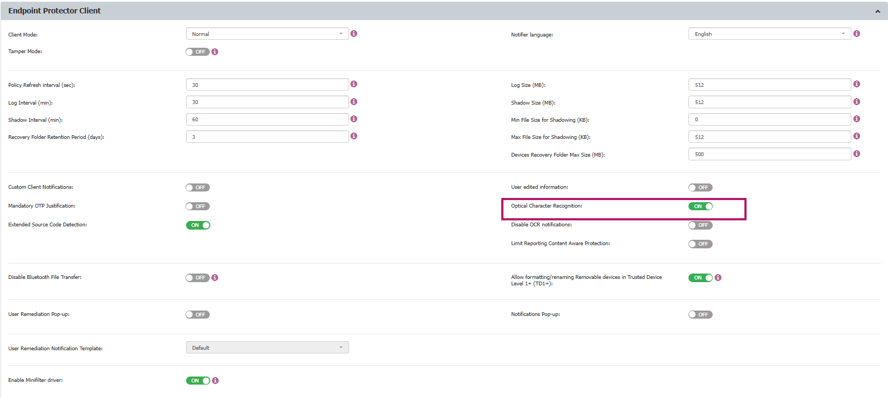

# Can Optical Character Recognition Be Enabled for File Inspection?

## Question
Can you enable Optical Character Recognition (OCR) for file content inspection?

## Answer
Yes, OCR is the process that converts an image of text into a machine-readable text format. This feature is available for **Windows**, **macOS**, and **Linux** machines.

You can enable OCR at the global, computer, user, or group level from the following location in the Endpoint Protector console:

Once enabled, the Endpoint Protector client can inspect the content of **JPEG**, **PNG**, **GIF**, **BMP**, and **TIFF** file types. Enabling this option will also update the global MIME Type Allowlists.
