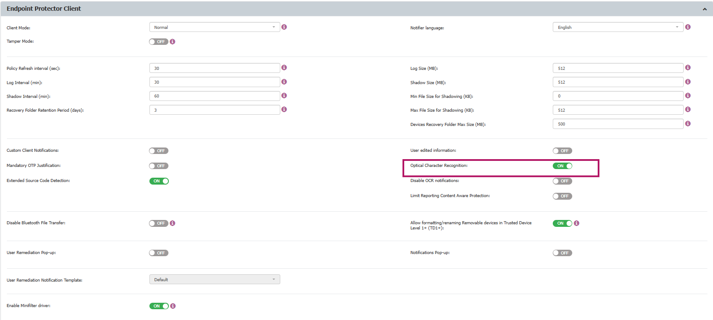

# Can Optical Character Recognition Be Enabled for File Inspection?

## Question
Can you enable Optical Character Recognition (OCR) for file content inspection?

## Answer
Yes, OCR is the process that converts an image of text into a machine-readable text format. This feature is available for **Windows**, **macOS**, and **Linux** machines.

You can enable OCR at the global, computer, user, or group level from the following location in the Endpoint Protector console. See [Client Settings](/docs/endpointprotector/admin/dc_module/globalsettings#client-settings) for the full list of related options, including **Disable OCR notifications**.

Once enabled, the Endpoint Protector client can inspect the content of **JPEG**, **PNG**, **GIF**, **BMP**, and **TIFF** file types. Enabling this option will also update the global MIME Type Allowlists.

:::note
Starting with EPP Client 5.9.4.3 Hotfix 1, Endpoint Protector uses an improved native OCR engine. Independent testing measured a 525% decrease in detection time and a 462% increase in fully accurate detections compared to the previous engine. The updated engine also extends OCR coverage to images embedded in PDF files, on Windows and macOS, and to HEIC images on macOS. No additional configuration is required to use the improved engine beyond enabling OCR as described above.
:::

On Windows, the OCR engine recognizes the same set of languages as the built-in Windows OCR engine (`Windows.Media.Ocr`), and only recognizes a language if its OCR language pack is installed on the endpoint. See Microsoft's [OcrEngine.AvailableRecognizerLanguages](https://learn.microsoft.com/en-us/uwp/api/windows.media.ocr.ocrengine.availablerecognizerlanguages) reference for the current list of supported languages.
