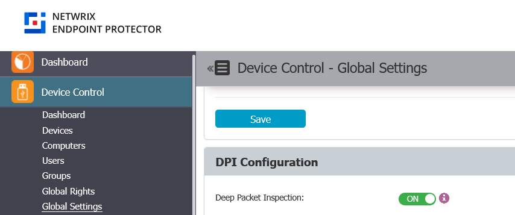
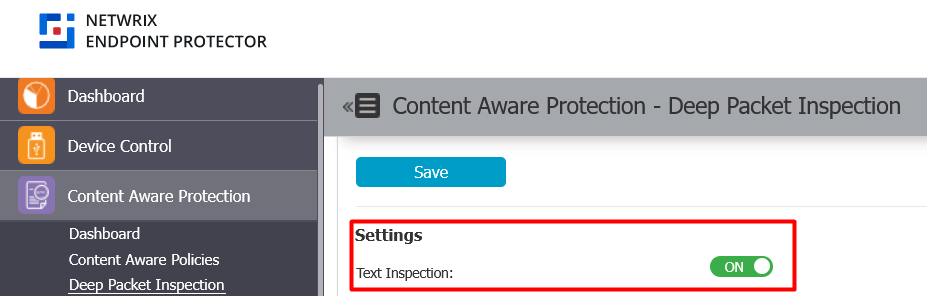

# Enable Deep Packet Inspection for Instant Messaging Applications

## Overview

The Netwrix Endpoint Protector (EPP) Client can inspect text written in instant messaging applications by using Deep Packet Inspection (DPI). This article explains how to enable DPI and configure text inspection for supported instant messaging applications.

## Instructions

### Enable DPI Globally

1. Go to **Device Control > Global Settings**.
2. Enable **Deep Packet Inspection**.
3. Save the setting.

### Enable Text Inspection

1. Go to **Content Aware Protection > Deep Packet Inspection**.
2. Enable **Text inspection**.
3. Save the setting.

### Enable DPI for Instant Messaging Applications

1. Go to **Content Aware Protection > Deep Packet Inspection**.
2. Scroll to **Deep Packet Inspection Applications**.
3. Filter for the instant messaging applications you want to use with text inspection. Supported apps include Teams, Skype, Slack, Mattermost, and Google Chat.
4. Click the **Actions** button and select **Enable DPI** for each application.

> **NOTE:** You must enable DPI for each application on every operating system where the EPP Client is installed (Windows, macOS, Linux).

### Configure Content Aware Policies for Instant Messaging Applications

1. Go to **Content Aware Protection > Content Aware Policies**.
2. Create or edit a policy.
3. Select the instant messaging applications you want to monitor.
4. Save the policy.

