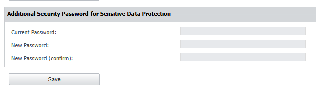

# Enable Sensitive Data Protection

## Overview

This article explains how to enable sensitive data protection on the Netwrix Endpoint Protector (EPP) Server by setting a security password. This feature provides additional security for sensitive sections of the Netwrix Endpoint Protector (EPP).

The security password protects the following sections of Netwrix Endpoint Protector (EPP):

- **Reports and Analysis:** Logs Report, File Tracing, Content Aware Report, Admin Actions, Published Computers, Published Users, Published Devices, Statistics.
- **System Maintenance:** File Maintenance, System Backup.

## Instructions

Follow the steps below to complete this process:

1. On the Netwrix Endpoint Protector (EPP) Server, navigate to **System Configuration** > **System Security**.
2. Under the section **Additional Security Password for Sensitive Data Protection**, enter a strong password in the **New Password** field.
3. Re-enter the chosen password in the **New Password (confirm)** field.
4. Click **Save** to apply the changes.

