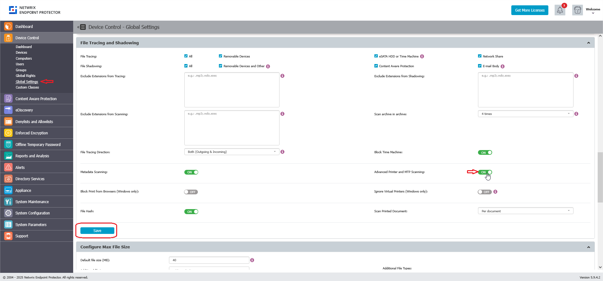

# Enabling Advanced Printer and MTP Scanning

## Overview

Netwrix Endpoint Protector includes an improved method for Printer and MTP Content Aware Protection; File Tracing and File Shadowing has been added. This enhancement increases accuracy and reduces false positives for file transfers via browsers (Internet Explorer, Firefox, Chrome) and other applications.

## Instructions

1. In the Netwrix Endpoint Protector Console, navigate to **Device Control** > **Global Settings**, **Groups**, or **Computers** > **Manage Settings** > **File Tracing and Shadowing**.
2. Toggle the switch to enable **Advanced Printer and MTP Scanning**.
3. Click **Save** within the **File Tracing and Shadowing** section.  
   
4. Save your changes and ensure the updated settings are deployed to Netwrix Endpoint Protector Clients by waiting for the clients to update their policies.
5. Restart the machines protected by Netwrix Endpoint Protector.

> **NOTE:** This feature is only available for Windows. A computer restart is required each time this feature is enabled or disabled.
