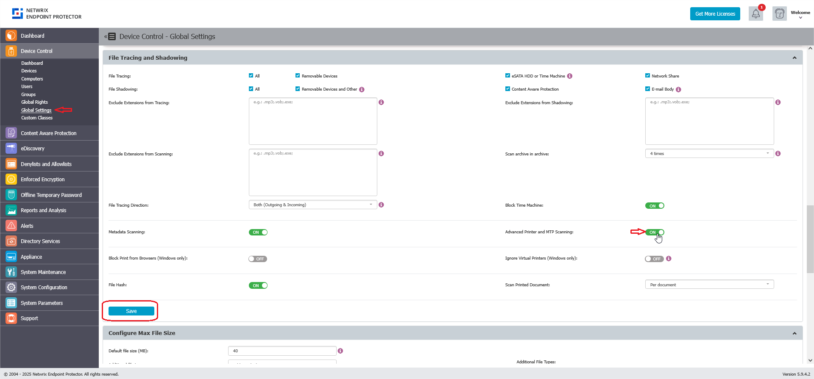

# Enabling Advanced Printer and MTP Scanning

## Overview

Netwrix Endpoint Protector includes an improved method for Printer and MTP Content Aware Protection; File Tracing and File Shadowing has been added. This enhancement increases accuracy and reduces false positives for file transfers via browsers (Internet Explorer, Firefox, Chrome) and other applications.

For the full reference, see [File Tracing and Shadowing](/docs/endpointprotector/admin/dc_module/globalsettings#file-tracing-and-shadowing) in the Global Settings documentation.

:::note
Advanced Printer and MTP Scanning works by loading a small DLL into supported Windows applications when they launch, hooking the Windows API functions responsible for printing and for copying files to MTP devices. For example, when a user opens Microsoft Word and prints a document, Endpoint Protector inspects the printed content through this DLL and can block the print operation if it contains sensitive data.
:::

## Instructions

1. In the Netwrix Endpoint Protector Console, navigate to **Device Control** > **Global Settings**, **Groups**, or **Computers** > **Manage Settings** > **File Tracing and Shadowing**.
2. Toggle the switch to enable **Advanced Printer and MTP Scanning**.
3. Click **Save** within the **File Tracing and Shadowing** section.  
   
4. Save your changes and ensure the updated settings are deployed to Netwrix Endpoint Protector Clients by waiting for the clients to update their policies.
5. Restart the machines protected by Netwrix Endpoint Protector.

:::note
This feature is only available for Windows. A computer restart is required each time this feature is enabled or disabled.
:::

:::tip
If a specific application experiences performance issues or unexpected behavior after you enable Advanced Printer and MTP Scanning, add it to the **Advanced Scanning Exceptions** list in the same **File Tracing and Shadowing** section. Endpoint Protector then skips DLL injection for that application.
:::
