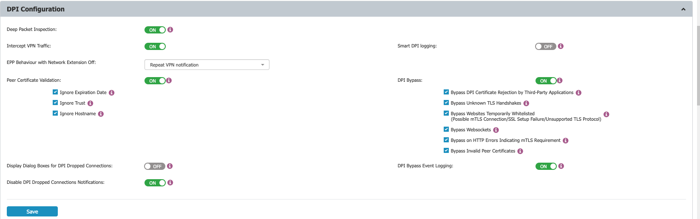
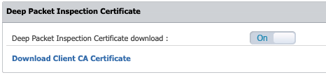

# Enabling Deep Packet Inspection and Intercepting VPN Traffic on macOS Clients

## Overview
This article describes how to enable Deep Packet Inspection and intercept VPN traffic on macOS clients. These instructions apply to Netwrix Endpoint Protector Server version 5.3.0.5 and later, and Netwrix Endpoint Protector Client version 2.2.1.5 and later. Ensure that you have installed the Netwrix Endpoint Protector Client and created the desired Content Aware Policy before proceeding.

## Instructions
1. Open the **Netwrix Endpoint Protector Server** interface. In the **Device Control** section, select **User**, **Computer**, **Group**, or **Global Settings**. Click **Manage Settings**, then select **Netwrix Endpoint Protector Client** and enable **Deep Packet Inspection**.  
   

2. Navigate to **System Configuration** > **System Settings** > **Deep Packet Inspection Certificate**. Download the CA certificate.  
   

3. Open the **Keychain Access** application on your macOS device. In the sidebar, select **System**.

4. Extract the contents of the downloaded `ClientCerts` file.

5. Locate the `cacert.pem` file. Drag and drop it into **Keychain Access** under **System**.

6. Find the newly added certificate, which displays an “x” icon. Double-click the certificate.

7. In the **Trust** section, set **When using this certificate** to **Always Trust**.

8. Click **Save** to apply your changes.

9. In the **Netwrix Endpoint Protector** interface, enable **Intercept VPN Traffic**. When prompted, select one of the following behaviors for when the network extension is disabled:
   - **Temporary Disable Deep Packet Inspection**: Temporarily disables Deep Packet Inspection.
   - **Block Internet Access**: Blocks Internet access until the user approves the Netwrix Endpoint Protector Proxy Configuration. The user can allow it after restarting the computer.
   - **Repeat VPN Notification**: Will repeat the network extension notification so that it can be allowed by the user. (This requires user interaction.)

10. Click **Save** to confirm your settings.

11. When prompted, review the pop-up message indicating that a system extension is blocked and must be allowed.

12. Open **System Preferences**, then navigate to **Security and Privacy** > **General** and allow the Netwrix Endpoint Protector Client extension.

13. When prompted, approve the Netwrix Endpoint Protector Proxy Configuration.

14. Confirm that **Intercept VPN Traffic** is enabled.

15. Disconnect and reconnect to the VPN to ensure all settings take effect in the Netwrix Endpoint Protector Client.
