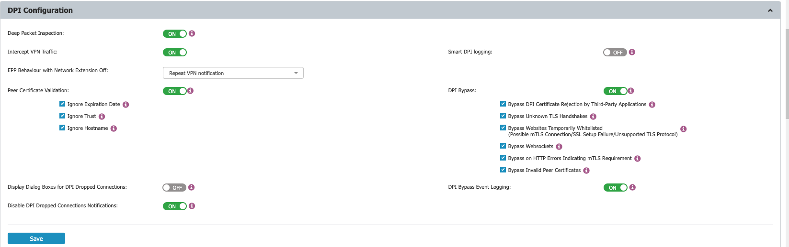
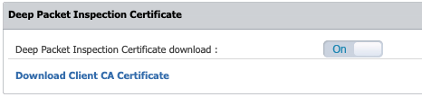

# Enabling Deep Packet Inspection and Intercepting VPN Traffic on macOS Clients

## Overview
This article describes how to enable Deep Packet Inspection and intercept VPN traffic on macOS clients. Ensure that you have installed the Netwrix Endpoint Protector Client and created the desired Content Aware Policy before proceeding.

For the full Deep Packet Inspection reference, including the Stealthy vs. Regular DPI modes referenced by the Intercept VPN Traffic setting, see [Deep Packet Inspection](/docs/endpointprotector/admin/cap_module/deeppacket).

:::note
Enabling Deep Packet Inspection can impact the upload speed of inspected files. Enabling **Intercept VPN Traffic** uses a network extension instead of Packet Filter, which is a possible workaround for this performance impact.
:::

:::note
Before configuring Deep Packet Inspection and VPN interception, confirm the EPP Client was installed with **Full Disk Access** granted (**System Preferences** > **Security & Privacy** > **Privacy** > **Full Disk Access**). See [Agent Installation](/docs/endpointprotector/admin/agent#agent-installation) for the full macOS installation steps, including this requirement.
:::

## Instructions
1. Open the **Netwrix Endpoint Protector Server** interface. In the **Device Control** section, select **User**, **Computer**, **Group**, or **Global Settings**. Click **Manage Settings**, then select **Netwrix Endpoint Protector Client** and enable **Deep Packet Inspection**.  
   

2. Navigate to **System Configuration** > **System Settings** > **Deep Packet Inspection Certificate**. Download the CA certificate.  
   

3. Open the **Keychain Access** application on your macOS device. In the sidebar, select **System**.

4. Extract the contents of the downloaded `ClientCerts` file.

5. Locate the `cacert.pem` file. Drag and drop it into **Keychain Access** under **System**.

6. Find the newly added certificate, which displays an “x” icon. Double-click the certificate.

7. In the **Trust** section, set **When using this certificate** to **Always Trust**.

8. Click **Save** to apply your changes.

:::warning
If the server's Certificate Stack is ever regenerated, you must repeat steps 2–8 to manually add the new certificate to Keychain Access. Endpoint Protector doesn't push certificate updates to macOS clients automatically.
:::

9. In the **Netwrix Endpoint Protector** interface, enable **Intercept VPN Traffic**. When prompted, select one of the following behaviors for when the network extension is disabled:
   - **Temporary Disable Deep Packet Inspection**: Temporarily disables Deep Packet Inspection.
   - **Block Internet Access**: Blocks Internet access until the user approves the Netwrix Endpoint Protector Proxy Configuration. The user can allow it after restarting the computer.
   - **Repeat VPN Notification**: Will repeat the network extension notification so that it can be allowed by the user. (This requires user interaction.)

10. Click **Save** to confirm your settings.

11. When prompted, review the pop-up message indicating that a system extension is blocked and must be allowed.

12. Open **System Preferences**, then navigate to **Security and Privacy** > **General** and allow the Netwrix Endpoint Protector Client extension.

13. When prompted, approve the Netwrix Endpoint Protector Proxy Configuration.

14. Confirm that **Intercept VPN Traffic** is enabled.

15. Disconnect and reconnect to the VPN to ensure all settings take effect in the Netwrix Endpoint Protector Client.

:::note
Restart the computer after enabling or disabling Deep Packet Inspection, or after upgrading Endpoint Protector, to ensure consistent DPI behavior.
:::
