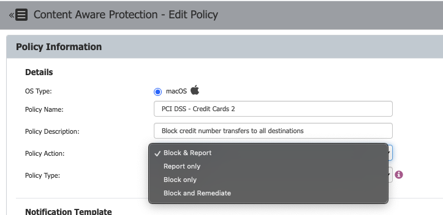

# Enabling User Remediation in Content Aware Protection Policies

## Overview

User Remediation allows end users to justify or remediate blocked actions when a Content Aware Protection policy is triggered. It is recommended to enable User Remediation after configuring a blocking policy for Content Aware Protection in Netwrix Endpoint Protector.

## Instructions

1. In the Netwrix Endpoint Protector Console, navigate to the **Content Aware Protection Policy** where you want to enable User Remediation.
2. Edit the policy and locate the **Policy Action** field.
3. Select **Block and Remediate** from the available actions.  
   
4. Click **Save** to confirm the changes. This will enable the User Remediation feature the next time the endpoint connects to the Netwrix Endpoint Protector Server.
