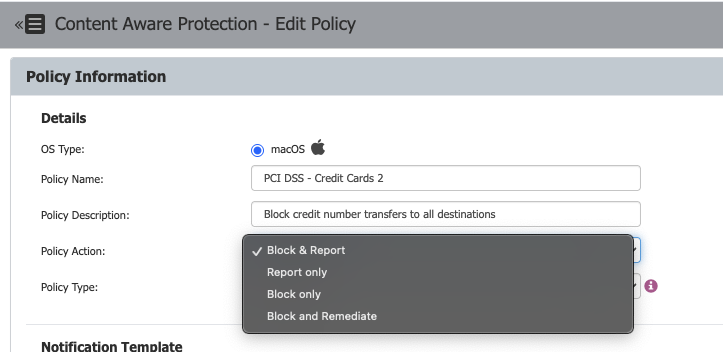

# Enabling User Remediation in Content Aware Protection Policies

## Overview

User Remediation allows end users to justify or remediate blocked actions when a Content Aware Protection policy is triggered. It is recommended to enable User Remediation after configuring a blocking policy for Content Aware Protection in Netwrix Endpoint Protector.

For the full reference, see [Block and Remediate Policies](/docs/endpointprotector/admin/cap_module/contentdetection#block-and-remediate-policies).

## Instructions

1. In the Netwrix Endpoint Protector Console, navigate to the **Content Aware Protection Policy** where you want to enable User Remediation.
2. Edit the policy and locate the **Policy Action** field.
3. Select **Block and Remediate** from the available actions.  
   
4. Click **Save** to confirm the changes. This will enable the User Remediation feature the next time the endpoint connects to the Netwrix Endpoint Protector Server.

:::note
You can manage additional Self Remediate settings, such as available justifications and the maximum remediation time interval, from **System Parameters** > [User Remediation](/docs/endpointprotector/admin/systempar#user-remediation).
:::

## Scope: Deep Packet Inspection Enabled vs. Disabled

Whether Deep Packet Inspection (DPI) is enabled changes what User Remediation actually unblocks:

- **DPI enabled:** User Remediation applies to a specific web domain. For example, remediating an upload on `uploadsite.com` only allows further uploads to `uploadsite.com`, not to other domains.
- **DPI disabled:** User Remediation applies to the entire application. For example, remediating an upload in Chrome allows uploads to any URL from Chrome.

DPI is enabled by default for browsers and desktop e-mail applications once turned on globally (**Global/Computers/Users/Group** settings). To extend it to other applications, go to **Content Aware Protection** > **Deep Packet Inspection** and enable it manually in the **Actions** column for each application.

## How End Users Remediate a Blocked Action

When a Block and Remediate policy triggers, the threat appears in the EPP notifier's **Content Aware Protection** tab (and as a pop-up notification, if enabled). To remediate:

1. Open the EPP notifier and go to the **Content Aware Protection** tab.
2. Select the file to remediate and click **Self Remediate**.
3. In the Self Remediate section:
   - Select a **justification** from the dropdown list.
   - Add a **reason** for the justification, if required.
   - Enter credentials if **Require Credentials** is enabled.
   - Set the **number of minutes** needed to remediate the device.
   - Click **Authorize**.

You can view the web domains remediated by users in the EPP Client's **Content Aware Protection** tab, under the **Web Domains** column.
