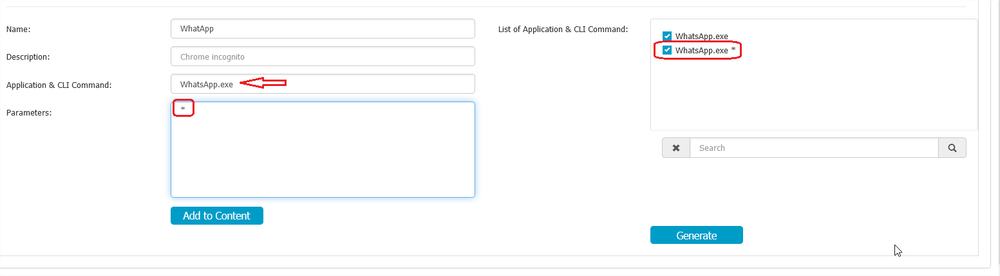
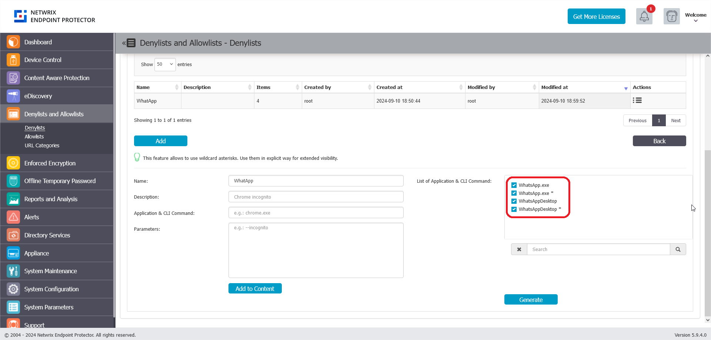
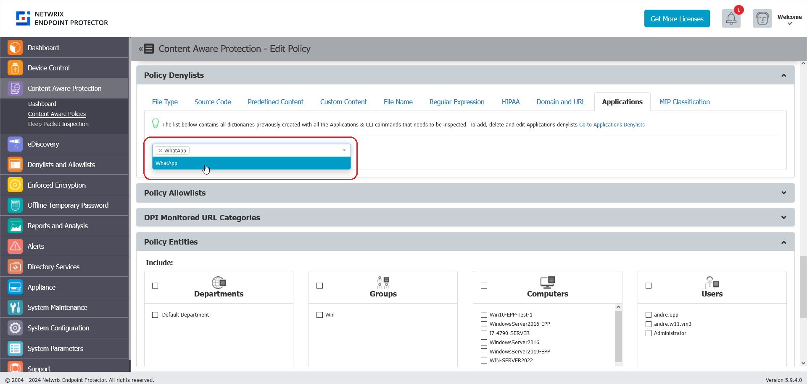

# How to Block WhatsApp Application from Launching

## Overview

This article explains how to block and prevent the WhatsApp application from opening on Windows and macOS computers by configuring an **Applications Denylist** in the Content Aware Protection policy of **Netwrix Endpoint Protector**.

For the full reference, see [Applications](/docs/endpointprotector/admin/denylistsallowlists/denylists#applications) in the Denylists documentation.

## Instructions

1. Navigate to the **Applications Denylist** configuration page.
2. For Windows operating systems:
   1. In the **Application & CLI Command** box, enter `WhatsApp.exe`.
   2. In the **Parameters** box, enter `*`.
   3. Click **Add to Content**.
   4. Verify that `WhatsApp.exe *` appears in the **List of Application & CLI Command** box on the right.  
      
3. For macOS operating systems:
   1. In the **Application & CLI Command** box, enter `WhatsAppDesktop`.
   2. In the **Parameters** box, enter `*`.
   3. Click **Add to Content**.
   4. Verify that `WhatsAppDesktop *` appears in the **List of Application & CLI Command** box on the right.  
      
4. Select all entries by checking their checkboxes, then click **Generate**.
5. The final result should display the denylist entries as shown below.  
   
6. Under **Policy Denylists** > **Applications** in the Content Aware Protection policy, select the application list you created.
7. Save the policy and update the policies on the endpoint computers. Ensure you assign the policy to the target computers.  
   
8. Attempt to open the WhatsApp Desktop application to confirm it is blocked.

:::note
The Applications Denylist matches on the application name and, optionally, the command-line arguments used to launch it. Using the wildcard `*` in the **Parameters** field, as in these steps, blocks the application regardless of the arguments used to launch it. The Endpoint Protector Client has limited visibility into launches from PowerShell, PowerShell ISE, and basic command-line operations on macOS and Linux — see [Applications](/docs/endpointprotector/admin/denylistsallowlists/denylists#applications) for details.
:::
