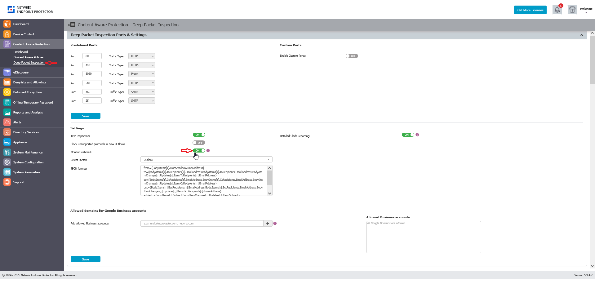

# How to Monitor Webmail for Gmail, Outlook, and Yahoo

## Overview

This article explains how you can enable the **Monitor webmail** setting in Netwrix Endpoint Protector, which allows subject and body scanning for Gmail, Outlook, and Yahoo webmail in browsers.

## Instructions

1. Navigate to **Content Aware Protection** > **Deep Packet Inspection**.  
2. Toggle the switch to enable the **Monitor webmail** setting.

When you enable this setting, it allows monitoring of the subject and body fields for Gmail, Outlook, and Yahoo webmail accessed through browsers.

