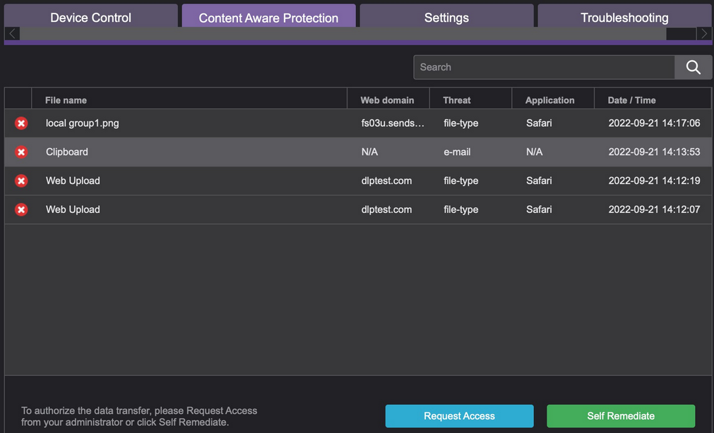

# How to Add a New Entry to the Justification List

## Overview

This article explains how to add a new entry to the Justification List in Endpoint Protector (EPP) and apply it to a Content Aware Protection policy for user remediation.

## Instructions

1. In the Endpoint Protector Console, navigate to **System Parameters** > **User Remediation**.  
   

2. Create a **Justification** list that will appear to the end user when an explanation is required to remediate a file:
   - Click the **ADD** button.
   - On the **Justification** tab, add a question (for example, "Why is the Print Screen required?").
   - Change the status to **Enable** and set the reason to **Yes**.
   - Click **Save**.

3. After saving the Justification list, navigate to the top of the console and select the **Content Aware Protection** menu.

4. Create a policy to apply user remediation:
   - Select the operating system (OS) and enter a name for the policy.
   - At the policy action button, select **Block and Remediate** from the drop-down menu.
   - In the **Policy Exit** points, check the box for **Print Screen**.
   - Scroll down to **Policy Entities** and select the departments, groups, computers, or users to which you want to apply the policy.
   - Click **Save** at the bottom of the page.

5. On an endpoint where the policy is applied, open the EPP client and update the policies.

6. To test the policy, attempt to use the print screen function. The client should display a prompt as shown below:  
   

7. If the user clicks the **Self-Remediate** button, a new window will appear prompting them to fill in the reason for the action.  
   