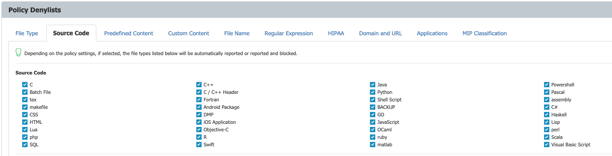

# How to Block Source Code Using OCR

## Overview

This article explains how to block source code in images by enabling Optical Character Recognition (OCR) and configuring a Content Aware Protection policy. Use these steps to prevent the transfer or upload of images containing source code.

## Instructions

### Enabling OCR

Follow these steps to enable OCR to allow the system to detect source code in images:

1. In **Endpoint Protector**, navigate to **Device Control > Global Settings**.
2. Enable the OCR option.
3. Click **Save** to apply the settings.

### Creating a Content Aware Protection Policy for Source Code

Follow these steps to create a custom policy to block or report source code detected in images:

1. In **Endpoint Protector**, navigate to **Content Aware Protection**.
2. Select the operating system type, enter a policy name, and choose the action and type for the policy.
3. Choose all relevant exit points.
4. Select only the relevant source code types.  
   
5. Select the computers and/or users to which the policy should apply.
6. Click **Save** to create the policy.
7. The system will now block or report source code found in transferred or uploaded images according to the policy settings.