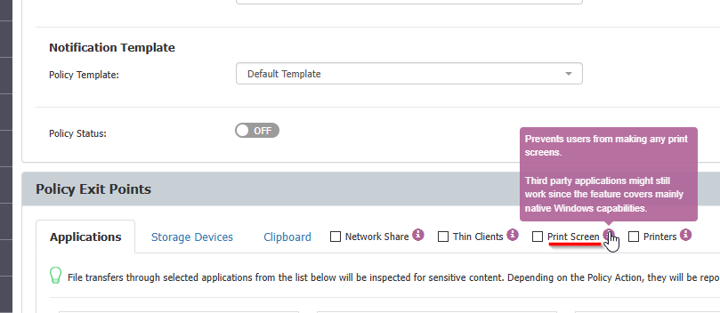

# Resolve Black Screen Issues During Remote Access

## Overview

This article explains how to prevent a black screen from appearing when accessing a machine remotely. This issue can occur if a Content Aware Protection (CAP) policy has **Print screen** blocking enabled along with the **Advanced Printer and MTP Scanning** setting checked.

The **Print screen** blocking feature prevents capturing the content of windows on the screen when accessed remotely or during screen sharing in a meeting.

## Instructions

Follow the steps below to resolve this issue:

1. Open the CAP policy settings by navigating to **Content Aware Policies** and **Edit** the policy.

   

2. Disable the **Print screen** blocking option.

   

3. Save the changes to the policy.
