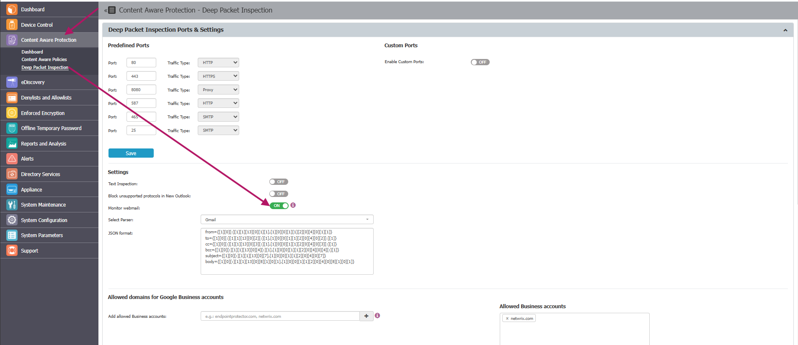

# Utilize the Monitor Webmail Setting for Subject and Body Scanning

## Overview

The **Monitor webmail** setting in Netwrix Endpoint Protector enables subject and body scanning for web-based email services, including Gmail, Yahoo, and Outlook, when accessed through a browser. This article explains how to enable the Monitor webmail setting, describes its behavior, and highlights important considerations and limitations, especially when using Yahoo and Linux environments.

:::note
When using Yahoo, the email recipients whitelist for attachments will work only if the attachment is uploaded after the recipients are added. If the recipients are modified after the attachment has been added, the file will not be scanned again or validated against the new recipients list. Inconsistent behavior may be experienced on Linux machines.
:::

## Instructions

1. Activate the **Deep Packet Inspection** module if it is not already activated.
2. Go to **Content Aware Protection** > **Deep Packet Inspection** and check the **Monitor webmail for Gmail** setting.  
   
   
3. Go to **Content Aware Protection** and create the desired policy.

:::note
Endpoint Protector extracts the subject and body from webmail pages using a JSON parser. If a webmail provider changes its page structure and subject or body extraction stops working, see [Monitor Webmail JSON Format Parser Usage](/docs/endpointprotector/admin/cap_module/deeppacket#monitor-webmail-json-format-parser-usage) for the parser syntax and examples. Only adjust the parser if Monitor webmail stops working — don't change it otherwise.
:::
