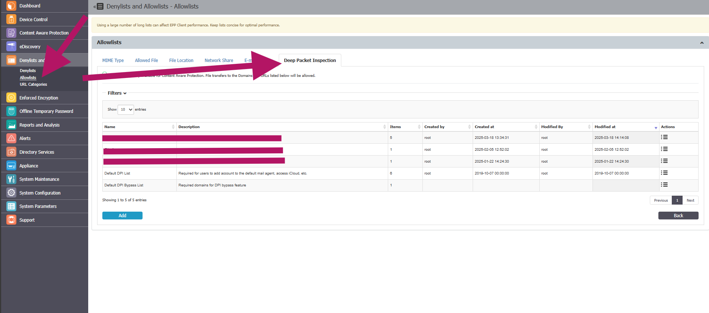
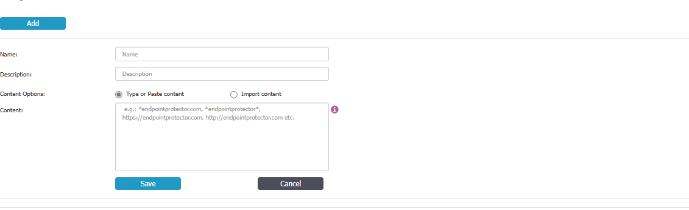
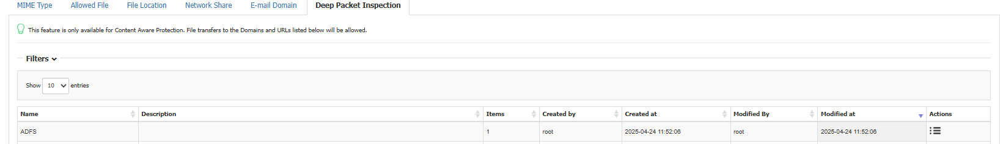
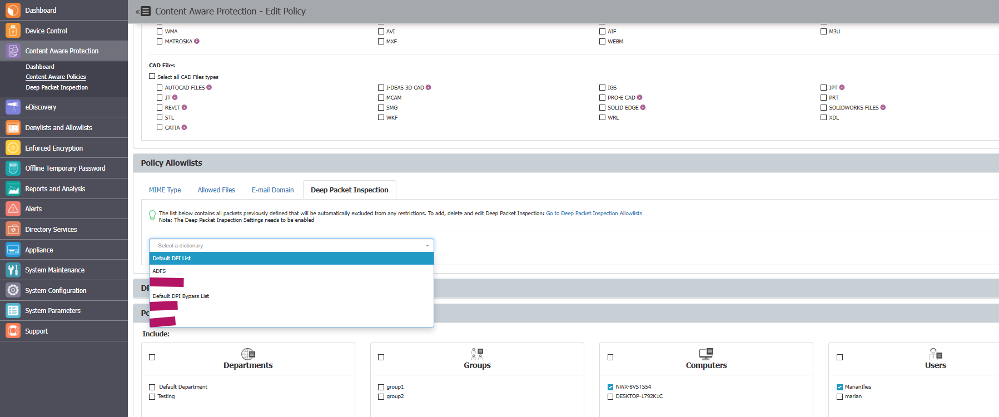
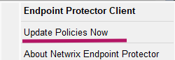

# Whitelisting Authentication Servers for Deep Packet Inspection

## Overview

When Deep Packet Inspection (DPI) is enabled in environments using an authentication server, you must whitelist authentication resources to prevent authentication timeouts or failures. Without these allowances, the authentication service may detect DPI as a "man in the middle" and block or delay authentication attempts.

This article describes how to whitelist authentication servers in Netwrix Endpoint Protector to ensure successful authentication when DPI is enabled.

## Instructions

1. Log in to the Netwrix Endpoint Protector Console.
2. Go to **Denylists and Allowlists** and select **Allowlists**.  
   
3. Select the **Deep Packet Inspection** tab and click **Add**.  
   
4. Fill in all required fields to define your authentication resource(s) (e.g., ADFS), then click **Save**.  
   
5. Go to **Content Aware Protection** > **Content Aware Policies** and select your policy then click **Edit**.
6. Navigate to the **Policy Allowlists** section and click the **Deep Packet Inspection** tab.
7. Select the entry defined in step 4 and verify the accuracy of your selected policy entities.  
   
8. Click **Save**.
9. On the managed endpoint, right-click the System Tray or Menu Bar item for Netwrix Endpoint Protector and select **Update policies now**.  
   
10. Verify that authentication succeeds when DPI is enabled.

