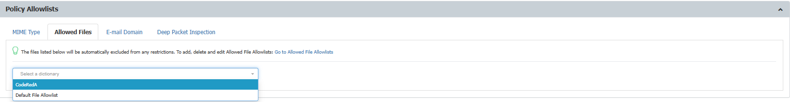

# Will Content Aware Protection Block Sensitive Content in Files from the Allowed File Allowlist?

## Question

Will Content Aware Protection block sensitive content files from the "Allowed File" Allowlist?

## Answer

No, Content Aware Protection will not block sensitive content in files that are included in the "Allowed File" Allowlist. **Allowed Files** Allowlists are custom groups of files you exclude from Netwrix Endpoint Protector sensitive content detection. These allowlists are available for both the Content Aware Protection and eDiscovery modules.

You can find the Allowed Files allowlist under **Denylists and Allowlists** > **Allowlists** > **Allowed File.**

After creating the allowlist, add it to the Content Aware Protection (CAP) policy under **Policy Allowlists.**

Once the allowlist is assigned to the policy, the Content Aware Protection policy will inspect but ignore sensitive content in files included in the Allowed File list. Files on the allowlist are not blocked, even if they contain sensitive content.
