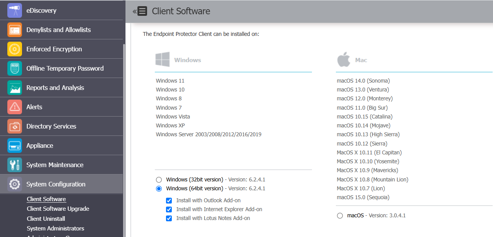

# Activating the Mail Add-in for Domain Allowlist in Outlook Classic for Windows

## Overview

This article explains how to activate the Endpoint Protector (EPP) Mail Add-in in Outlook Classic for Windows, which is required to use the Domain Allowlist feature for email. The add-in must be enabled for the allowlist to function correctly with Outlook.

## Instructions

1. In the EPP Console, ensure the Mail Add-in is included when downloading the client.

   

2. To verify that the EPP Mail Add-in is present in the list of active add-ins, open Outlook and navigate to **Outlook Options** > **Add-ins** > **Active Add-ins**.

3. If the add-in is not active, activate it and restart Outlook to apply the new settings.

4. To use the Domain Allowlist, ensure the email domains are added under **Denylists and Allowlists** > **Allowlists** > **Email Domain**.

5. To verify that the email domains are selected in the relevant Content Aware Policy, navigate to the policy and edit.

6. Expand the **Policy Allowlists** section.

7. Go to **Email Domain** and select the appropriate email domain dictionary.

8. Save the policy.

> **NOTE:** On non-Windows endpoints, Deep Packet Inspection must be enabled to use the Email Domain Allowlist.