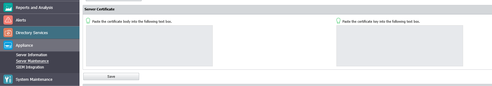

# How to Add an SSL Certificate to Endpoint Protector

## Overview

This article provides guidance on adding an SSL certificate to Endpoint Protector. An SSL certificate must be generated either on your side or by using a third-party application.

## Instructions

Follow the steps below to add an SSL certificate to Endpoint Protector:

1. In the Endpoint Protector Console, navigate to **Appliance > Server Maintenance**.  
   

2. Once a `.pem` SSL certificate is generated (`certificate.pem` and `certificate.key`), paste their contents into the self-signing certificate fields and save the changes.  
   > **NOTE:** When copying the certificate and key, ensure you select the **BEGIN** and **END** lines.

3. Allow 5–10 minutes for the changes to apply, then close and re-open the console completely.