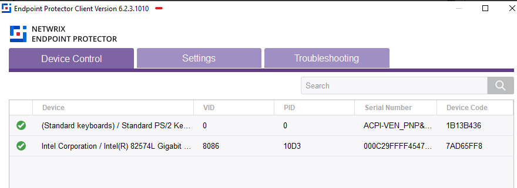
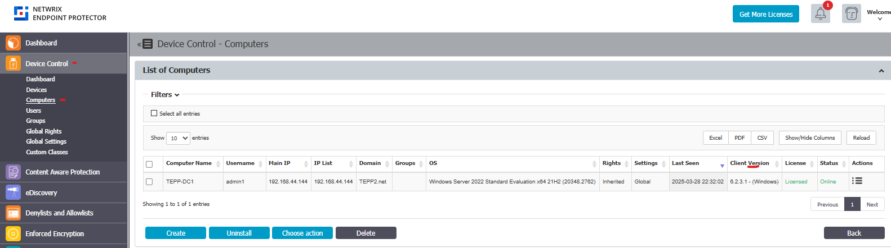

# Check the Client Version Installed on Your Computer

## Overview

This article explains how to check the version of the client installed on your computer. You can view the version directly from your computer or through the management console.

## Instructions

You can use either of the following options to check the installed client version:

1. Click the client icon in the system tray to view the installed version directly on your computer.  
   

2. Open the **Endpoint Protector Management Console** and go to **Device Control > Computers**. Check the **Client Version** column to see the version installed on each computer.  
   

## Understanding the Displayed Version

The system tray icon and the **Client Version** column show the client's raw internal build number, not a release name. Older releases identified themselves only by a release version number (for example, **5.9.4.3 Hotfix 1**) in documentation, while each platform's installed package used its own internal build number:

| Release Version | Windows Client Build | macOS Client Build | Linux Client Build |
|---|---|---|---|
| 5.9.4.1 and older | 6.2.4.xxxx and older | 3.0.4.xxxx and older | 2.4.4.xxxx and older |
| 5.9.4.3 Hotfix 1 | 6.2.5.3000 | 3.0.5.3000 | 2.4.5.1002 |
| 2511 and later | `YYMM.1.C.B` (for example, 2511.1.1.0) | `YYMM.2.C.B` (for example, 2511.2.1.0) | `YYMM.3.C.B` (for example, 2511.3.1.0) |

Starting with the **2511** release, Endpoint Protector adopted a unified versioning scheme applied consistently across the Server and all Clients, where `YYMM` is the release year and month. For the full format breakdown, see [Unified EPP Clients and Server Versioning](/docs/endpointprotector/install/overview#unified-epp-clients-and-server-versioning).

## Related Links

- [Client Upgrade Management](/docs/endpointprotector/install/migrationprocedure/clientupgrade#is-a-bridge-client-required-for-2608) — covers the same release-to-build mapping in the context of upgrading clients during a server migration.