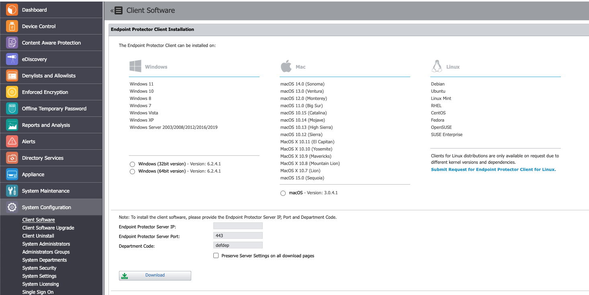

# Deploying Endpoint Protector Agents

## Overview

This article explains how to deploy Endpoint Protector agents to endpoint systems. You should deploy agents before modifying policies to perform blocking. This approach allows you to identify any system variables that may require allowances and gives you an opportunity for end-user feedback.

## Instructions

1. Retrieve the Endpoint Protector Client package(s) from the Endpoint Protector Management Console under **System Configuration** > **Client Software**.  
   

2. For Windows, select the add-ons that align with your blocking strategy. You can choose any combination of add-ons, or none at all.

3. Download the package and begin deployment using your preferred deployment tool.

4. For macOS installations, provide Full Disk Access after installation:
   I. Navigate to **System Preferences** > **Security & Privacy** > **Privacy** tab > **Full Disk Access**.  
   II. Locate the **Endpoint Protector Client**, check the application, and save the changes.
