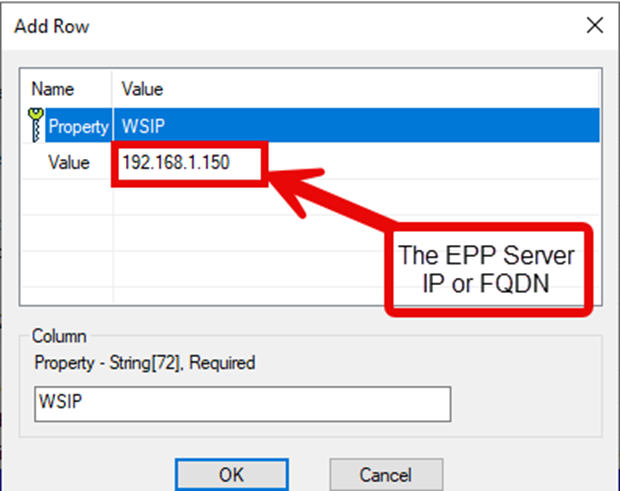
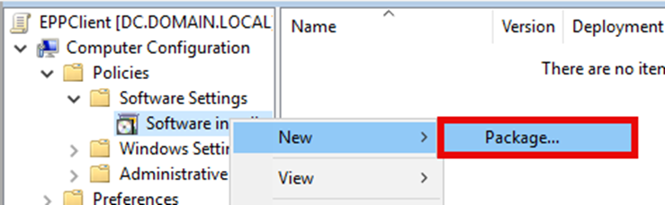
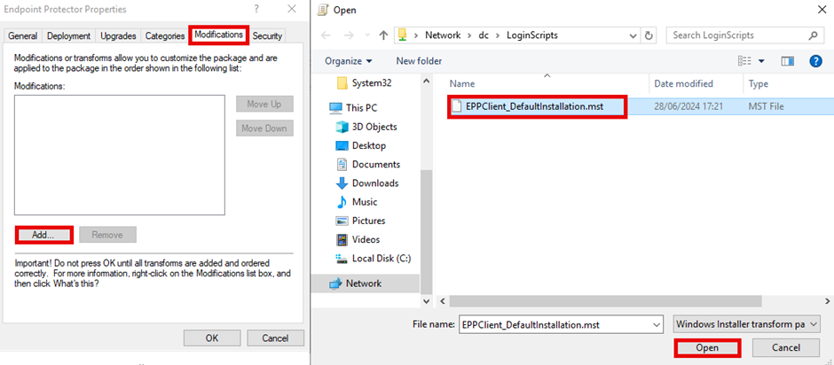

# How to Deploy the Windows Endpoint Protector Agent

## Manual Installation

If installing the Netwrix Endpoint Protector Agent on a small number of clients or for testing, the agent can simply be installed by downloading the MSI Package from the Netwrix Endpoint Protector Console and executed. When downloaded from the console, the installer will have a name that follows the below convention, where `\<VERSION_INFO\>` is replaced with the agent version and `\<ENDPOINT_PROTECTOR_SERVER_ADDRESS\>` is replaced with the Netwrix Endpoint Protector server IP or URL:

`EPPClientSetup.<VERSION_INFO>._x86_64_[a=<ENDPOINT_PROTECTOR_SERVER_ADDRESS>].msi`

Example installer:

`EPPClientSetup.6.2.2.1006_x86_64_[a=10.0.0.86].msi`

Note: This does not apply to the Netwrix Endpoint Protector Hotfix, as agents were not included in the server patch. To download the agents, please go to the security advisory located at https://security.netwrix.com/Advisories/ADV-2024-002 and download the required agent(s).

## Silent Installation

You can install the Netwrix Endpoint Protector Windows agent silently by using `msiexec` and specifying the options required for your environment.

## Examples

In all the below examples, replace `EPPClient.msi` with the name of the MSI being used.

### Basic Installation

To install the Netwrix Endpoint Protector Agent with the defaults and the EPP server located at `192.168.1.50`, use the following:

```batch
msiexec /i "C:\EPPClient.msi" /qn WSIP=192.168.1.50
```

### Installation with Non-Default Department

Use the same as the basic installation and specify your department code using the `DEPT_CODE` property:

```batch
msiexec /i "C:\EPPClient.msi" /qn WSIP=192.168.1.50 DEPT_CODE=depfin
```

### Installation with Agent-Specific Proxy Settings

To install the agent with a proxy that doesn’t require authentication, use the `PROXYSETTINGSRBGPROP`, `PROXYIP`, and `PROXYPORT` options along with the basic installation. The following will set the agent's proxy to `10.0.0.10:8080`:

```batch
msiexec /i "C:\EPPClient.msi" WSIP=192.168.1.50 PROXYSETTINGSRBGPROP=ManualProxy PROXYIP=10.0.0.10 PROXYPORT=8080
```

Advanced Installations customers requiring further options should see the Appendix for the full list of properties that can be specified.

## Deploying the Agent via Group Policy

Deploying the agent via Group Policy requires editing the MSI either directly or via an MSI transform file to be created and the specific properties updated in the transform. To do this, follow the instructions below:

1. Download the Orca MSI (or your preferred MSI editing software; these instructions use Orca).
   1. Orca can be installed from the Windows SDK and selecting the MSI options.

   

2. Right-click on the `EPPClientSetup` MSI and select **Edit with Orca**.

   

3. Click on **Transform** > **New Transform**.
4. Add the required properties to the Property Table.
   1. Find and open the Property table.
   2. Right click in the table and select **Add Row**.
   3. In the popup box, input **WSIP** as the property, and then add your Netwrix Endpoint Protector Server IP Address or FQDN as the value.
   4. Click **Ok**.
   5. Optional: If there are more properties that need changing or adding, such as not using the default department code, refer to the Appendix for the list of properties and change them all in the Properties table.

   

   

5. Generate the Transform.
   1. Click on **Transform**.
   2. Click on **Generate Transform**.
   3. In the open box, save your transform.
   4. Ensure the packages are placed on a network share that is accessible to all clients that need to install it.

   

6. Deploy the MSI with the Transform file via Group Policy.
   1. Open Group Policy Management Console.
   2. Find or create a new group policy for the deployment.
   3. Right click on the group policy object and select **Edit…**
   4. Expand **Computer Configuration** / **Policies** / **Software Settings**.
   5. Right-click **Software Installation** and select **New** > **Package**.
   6. Select the Advanced option on the Deploy Software dialog box.
   7. Browse to the network share where the installer and transform were placed in step 5.
   8. Select the `EPPClientSetup` MSI file and click **Open**.
   9. In the new window, select the **Modifications** tab.
   10. Click **Add** and browse to your saved transform file on the network share.
   11. Select the transform file and click **Ok**.
   12. Click **Ok**.

   
   
   
   
   

## Appendix

A full list of properties that can be specified in the installer can be found in this table.

| Property | Example Values | Description |
|---|---|---|
| **WSIP** | `EPPServer.domain.local` | The name or IP address of your Netwrix Endpoint Protector Server. If this is not specified, then the value of `[a=XXX]` from the name of the installer is used for new installations. For existing installations, the registry is used. |
| **WSPORT** | `443` | The port on which the Netwrix Endpoint Protector Server is listening for agents. Default value: 443 |
| **DEPT_CODE** | `Defdep` | The department code to assign the computers. Default value: defep |
| **PROXYSETTINGSRBGPROP** | `SystemProxy` | Whether to use the System settings for proxy or to use the agent's own proxy configuration. Default: SystemProxy Allowed values: ManualProxy, SystemProxy |
| **PROXYIP** | `192.168.1.200` | The IP Address of the proxy server. This is only used when **PROXYSETTINGSRBGPROP** is set to ManualProxy. |
| **PROXYPORT** | `8080` | The port to use for the proxy server. This is only used when **PROXYSETTINGSRBGPROP** is set to ManualProxy. |
| **AUTHCHECKBOXPROP** | `1` | Enable this to use Authentication on the proxy. Allowed values: 0 (Disabled), 1 (Enabled) |
| **AUTHUSER** | `ProxyUser` | The username for the user that will authenticate to the proxy. |
| **AUTHPASSWORD** | `P@ssw0rd123` | The password for the user that will authenticate to the proxy. |
| **INSTALL_NOTES_EXT** | `1` | Installs the Lotus Notes Add-on. Default value: 1 (Install) Allowed values: 1 (Install), 0 (Don't install) |
| **INSTALL_OUTLOOK_EXT** | `1` | Installs the Outlook Add-on. Default value: 1 (Install) Allowed values: 1 (Install), 0 (Don't install) |
