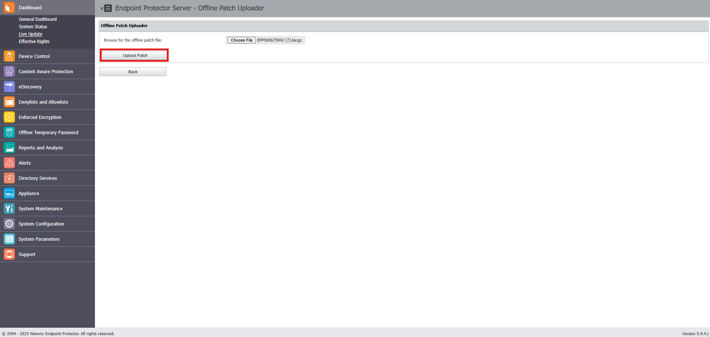
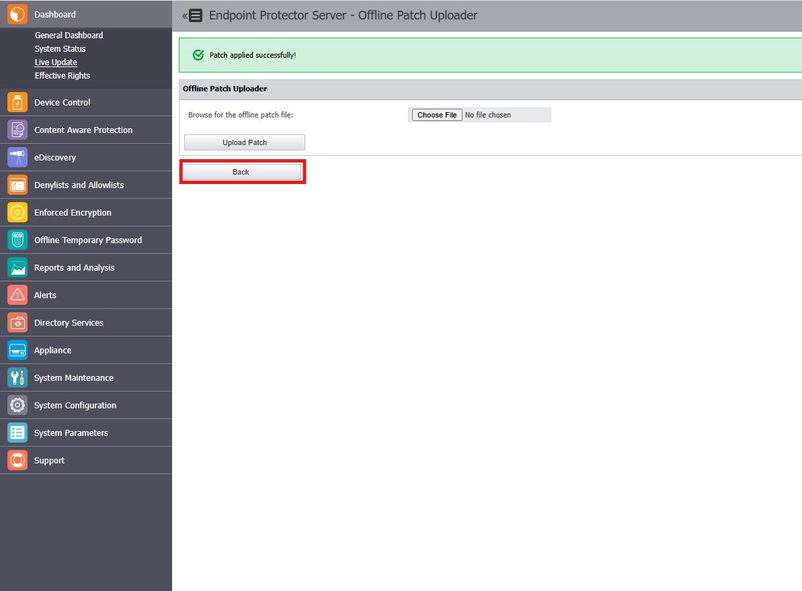
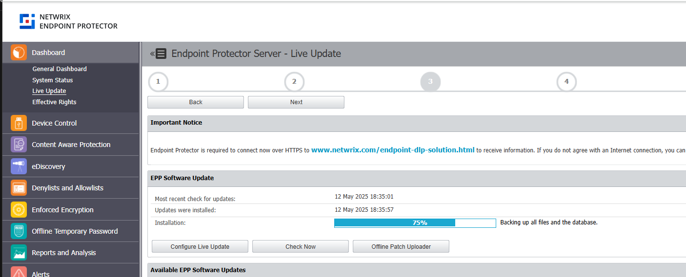
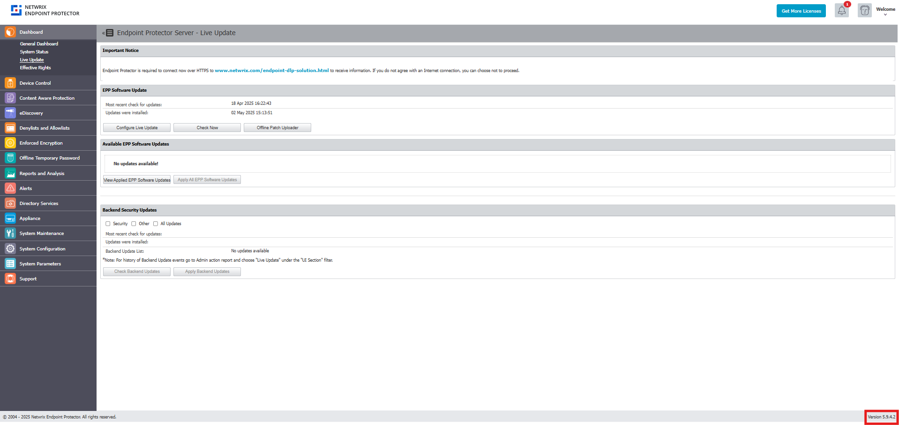

# How to Apply an Offline Patch or Upgrade

## Overview

This article explains how to apply an offline patch or upgrade to **Endpoint Protector** (EPP) when the appliance does not have direct internet access or when you need to control the timing and process of software updates. The instructions include preparing your environment, safely applying the patch, and verifying the update.

For the full reference, see [Server Update](/docs/endpointprotector/admin/systemconfiguration/overview#server-update) in the System Configuration documentation.

:::note
The Offline Patch Uploader is the only currently available update method — Live Update was dropped starting with the 5.9.4.2 release and remains unavailable on the current 2509+ image-based platform.
:::

:::tip
If you're migrating a 5.x server to the current image-based platform (2510/2604) rather than applying a routine patch, follow the [EPP Server Migration & Upgrade Guide](/docs/endpointprotector/install/migrationprocedure/migrationguide) instead — it covers the mandatory intermediate upgrade to 5.9.4.2 and the full migration sequence in detail.
:::

To stay informed about future version releases, visit the [Netwrix Community Endpoint Protector](https://community.netwrix.com/c/products/endpoint-protector/22) page and click the **Subscribe** button.

## Instructions

### Prepare for the Upgrade

- Before applying any update, create a snapshot of your **Endpoint Protector Appliance** virtual machine (VM, AWS, Azure, or GCP) as a best practice.
- Confirm your current EPP server version. You can find the version in the lower right corner of the console interface.

### Obtain the Offline Patch

All offline patches are available from the [My Products portal on netwrix.com](https://customer.netwrix.com/sign_in.html?rf=my_products.html). Sign in and download the offline patch file matching your current server version and the version you want to upgrade to.

:::note
See the [EPP Server Migration & Upgrade Guide](/docs/endpointprotector/install/migrationprocedure/migrationguide) to verify which upgrade patches are available for your current version. If the patch you need is missing from the My Products portal, contact Netwrix Technical Support for assistance.
:::

### Apply the Offline Patch

1. Open a web browser and access the **Endpoint Protector** console's web interface.
2. Log in with an account that has administrator privileges.
3. Navigate to **Dashboard** > **Live Update** > **Offline Patch Uploader**.  
   
4. Select **Choose File**. Browse for the downloaded or provided offline patch file and click **Upload Patch**.  
   
5. Wait for a green confirmation message stating **Patch applied successfully!** to appear above the Offline Patch Uploader section.  
   
6. Remain on the page and monitor the upgrade progress at **Dashboard** > **Live Update**. The progress bar should reach 100%, usually within 5–10 minutes, depending on your database size.  
   
7. After the upgrade completes, refresh your browser and verify the updated server version in the bottom right corner of the console interface.  
   
8. If you need to apply additional offline patches, repeat steps 4–7. Offline patches are incremental, like the Live Update functionality. You must apply them one at a time to correctly upgrade the server and avoid issues.

:::note
There may be a delay between a new general availability (GA) release and the availability of an offline patch for the new server version.
:::