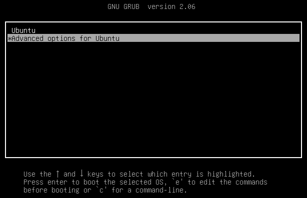
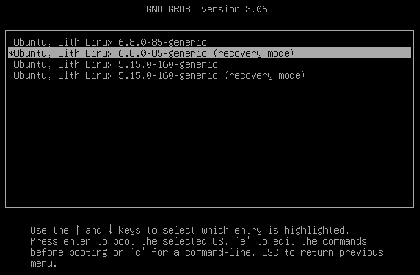
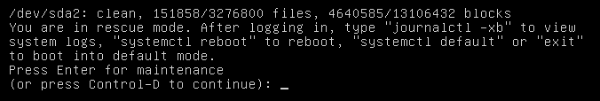
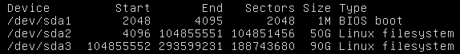
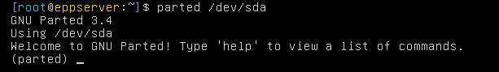
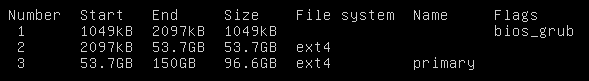
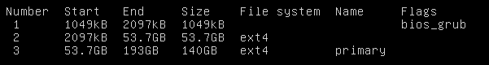
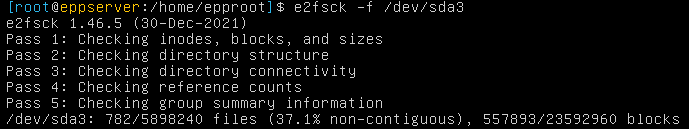
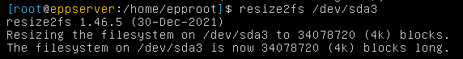
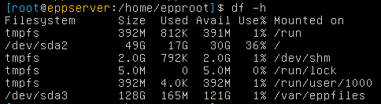

| The procedures and instructions provided in this document are intended for use by experienced administrators. Proceeding with these steps is done entirely at your own risk. Netwrix is not responsible for any data loss, system instability, or other issues that may arise from following these instructions. Ensure that you have a complete backup of your system before making any changes. |
|---------------------------------------------------------------------------------------------------------------------------------------------------------------------------------------------------------------------------------------------------------------------------------------------------------------------------------------------------------------------------------------------------|

## Overview

This article describes how to boot the Endpoint Protector (EPP) On-Prem appliance into **single-user (recovery) mode** and safely expand disk space after increasing the virtual disk size.  

These instructions apply only to **on-premises** EPP appliances.

---

## Instructions

1. **Shut down and increase the disk size**.

   - In your VM manager, shut down the EPP virtual machine.  
   - Increase the disk space (for example, from 100 GB to 200 GB).  
   - Reboot the EPP appliance.  
   - While it reboots, press the `Esc` key to open the **GRUB** boot menu, and select **Advanced options for Ubuntu**.

   

2. Choose the first entry labeled **(recovery mode)**.

   

3. Press **Enter** when prompted.

   

4. **Identify the last partition**.

   Run the following command to list available partitions:

   ```bash
   fdisk -l
   ```

   Review the output and identify the **last partition** (typically `/dev/sda3` or `/dev/sda5`, depending on the server version).

   

   > **NOTE:** The last partition may vary depending on your environment.

5. **Stop Endpoint Protector services**.

   Stop all EPP-related services before resizing:

   ```bash
   service nginx stop
   service cron stop
   service mysql stop
   service php-fpm stop
   service alt-php56-fpm stop
   service eppcloudsync stop
   service awslogs stop
   service syslog-ng stop
   pkill -f run_workers.php
   ```

   > **NOTE:** If a service is not running, proceed to the next command.

6. **Unmount the identified partition**.

   ```bash
   umount /dev/sda3
   ```
   or
   ```bash
   umount /dev/sda5
   ```

7. **Resize the partition**.

   Open the partition manager:

   ```bash
   parted /dev/sda
   ```

   

   - Type `p` to display the current partition table and sizes.  
     
   - Resize the **last partition** to the maximum available space:
     ```bash
     resizepart 3 100%
     ```
     > **NOTE:** If prompted about available space, type `fix` to continue.
   - Run `p` again to verify the new partition size:
     ```bash
     p
     ```
     
   - Exit the partition manager:
     ```bash
     quit
     ```
   - Refresh the kernel partition table:
     ```bash
     partprobe
     ```

8. **Check the file system**.

   Run a forced file system check (replace `sda3` with your actual partition if needed):

   ```bash
   e2fsck -f /dev/sda3
   ```

   

9. **Resize the file system**.

   ```bash
   resize2fs /dev/sda3
   ```

   

10. **Remount and verify disk size**.

    ```bash
    mount -a
    df -h
    ```

    

11. **Restart the appliance**.

    ```bash
    reboot
    ```

    After restart, verify that the disk space increase is reflected in your EPP appliance.
