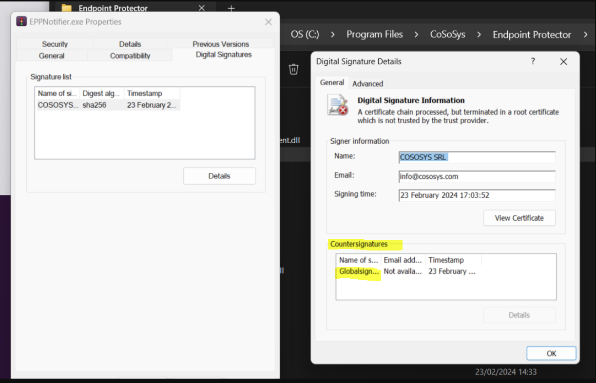
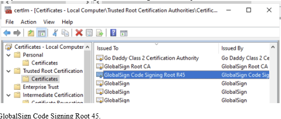

# Install GlobalSign and DigiCert Root Certificates on Windows

## Overview

This article explains how to install GlobalSign and DigiCert root certificates on Windows. These certificates may be required if you encounter digital signature errors when installing the Netwrix Endpoint Protector Client. The following error messages may populate:

- "A digitally signed driver is required"
- "Microsoft Defender SmartScreen prevented an unrecognized app from starting"

Installing the correct root certificates ensures that Windows recognizes the digital signatures used by Netwrix Endpoint Protector components.

## Instructions

1. To verify if the required GlobalSign root certificate is present, navigate to `Program Files\Cososys\EPPNotifier.exe`.
2. Right-click **EPPNotifier.exe** and select **Properties**.
3. Navigate to the **Digital Signatures** tab and select the certificate then click **Details**.  
   
4. If the GlobalSign root certificate is missing, download it from the official GlobalSign website:  
   GlobalSign Root Certificates ⸱ GlobalSign ↗️  
   https://support.globalsign.com/ca-certificates/root-certificates/globalsign-root-certificates
5. Search for the certificate named **GlobalSign Root R3** then download and install it in the **Trusted Root Certification Authorities** store.
6. If required, check for the **GlobalSign Code Signing Root R45** certificate in the certificate store:  
   
7. For digital signature time-stamping, ensure the **DigiCert Assured ID Root CA** certificate (valid until 10 November 2031) is trusted. Download it from:  
   DigiCert Root Certificates ⸱ DigiCert ↗️  
   https://www.digicert.com/kb/digicert-root-certificates.htm

## Related Links

- GlobalSign Root Certificates ⸱ GlobalSign ↗️  
  https://support.globalsign.com/ca-certificates/root-certificates/globalsign-root-certificates
- DigiCert Root Certificates ⸱ DigiCert ↗️  
  https://www.digicert.com/kb/digicert-root-certificates.htm
