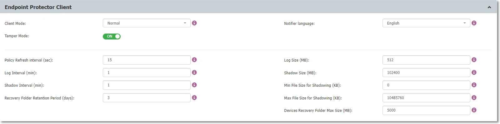

# Install Client on macOS with Deep Packet Inspection and VPN Traffic Intercept

## Overview

This article explains how to ensure all prerequisites are in place and how to install the Endpoint Protector (EPP) Client on macOS endpoints with Deep Packet Inspection (DPI) and VPN Traffic Intercept active.

For the full reference, see [Installation on macOS with Deep Packet Inspection and VPN Traffic Intercept Active](/docs/endpointprotector/admin/agent#installation-on-macos-with-deep-packet-inspection-and-vpn-traffic-intercept-active) in the Agent documentation. For DPI and VPN configuration steps only (if the client is already installed), see [Enabling Deep Packet Inspection and Intercepting VPN Traffic on macOS Clients](/docs/kb/endpointprotector/content-aware-protection-and-dpi/enabling-deep-packet-inspection-and-intercepting-vpn-traffic-on-macos-clients).

## Instructions

1. In the Endpoint Protector console, navigate to **System Configuration** > **Client Software** and download the macOS **Endpoint Protector Agent**.  
   

2. Unzip the downloaded file.

3. Open the **.pkg** file.

4. Follow the installation steps and grant the requested permissions.

5. After installation, go to **System Preferences** > **Security & Privacy** > **Privacy** tab > **Full Disk Access**. Search for **Endpoint Protector Client**. Select the checkbox and then save the changes.

6. In the Endpoint Protector console, navigate to **Device Control** > **Users/Computer/Group/Global Settings** > **Manage Settings** > **Endpoint Protector Client** > **Deep Packet Inspection** to enable DPI.  
   

7. Once enabled, go to **System Configuration** > **System Settings** > **Deep Packet Inspection Certificate** and download the **CA Certificate**.  
   

8. Open the **Keychain Access** application on your macOS and select **System**.  
   

9. Unzip the downloaded **ClientCerts** file.

10. Select the `cacert.pem` file and drag then drop it into **Keychain Access > System**.  
    

11. Double-click the newly added certificate and select **Always Trust**.  
    

12. **Save** the changes.

13. In **Device Control > Global Settings**, enable **Intercept VPN Traffic**.

14. Select one option for **EPP behavior when network extension is disabled**:
    - **Temporarily Disable Deep Packet Inspection** – This option will temporarily disable Deep Packet Inspection.
    - **Block Internet Access** – This option will end the Internet connection until the end user approves the **Endpoint Protector Proxy Configuration** once the computer is rebooted.

15. **Save** the changes.

16. A pop-up will be displayed informing the end user that a System Extension is blocked and needs to be allowed.

17. Go to **System Preferences** > **Security and Privacy** > **General** tab and **allow** the **Endpoint Protector Client Extension**.

18. **Allow** the **Endpoint Protector Proxy Configuration** from the pop-up window.

:::note
If EPPNotifier is not visible or notifications do not display after the installation or upgrade of the Endpoint Protector Client on macOS, restart your machine. If the Endpoint Protector Client is installed and then uninstalled on macOS, you may still see EPPNotifier in the Notification settings. To remove it from the list, right-click and select "Reset notifications."
:::