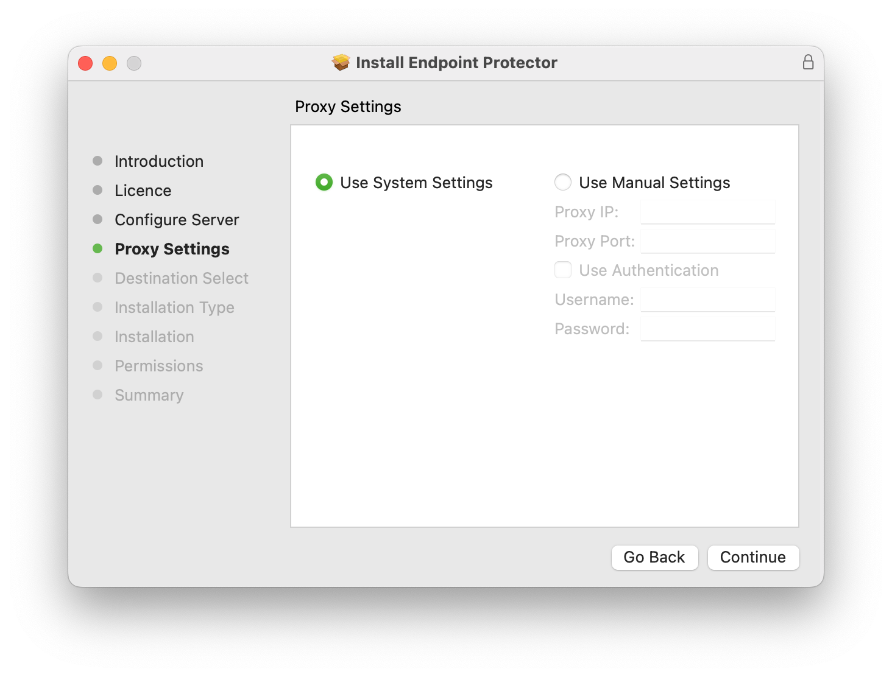

# Installing the Agent with Proxy Settings on MacOS

## Overview

This article explains how to install the Netwrix Endpoint Protector (EPP) agent on macOS when you use a proxy server. Proper configuration ensures the agent can communicate through your proxy environment.

## Instructions

Follow the steps below to install the EPP agent with proxy settings on macOS:

1. Download the installer from the **Netwrix Endpoint Protector Web Console**.
2. Run the package using an administrator account. Alternatively, you can start the installation from the Terminal using `sudo` rights.
3. During the installation process, when you reach the **Proxy Settings** section, select **Use Manual Settings** and fill in the required fields.
4. If your proxy requires authentication, enter valid credentials in the appropriate fields.
5. You can enter a proxy IP address, DNS name, or fully qualified domain name (FQDN) in the proxy IP field.

6. After installation is complete, wait a few minutes for processing. Then, verify that the computer appears in the **Device Control** > **Computers** section of the **Netwrix Endpoint Protector Web Console**.
