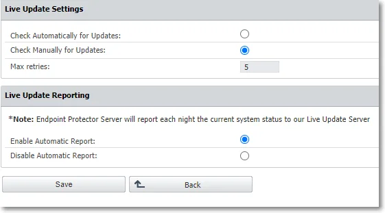
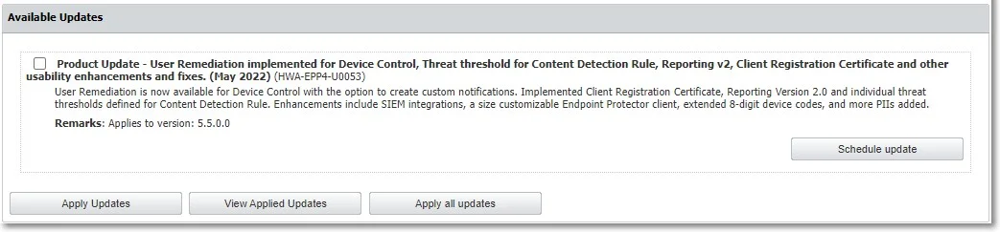

# Using the Live Update Feature on 5.x Legacy Appliances

## Overview

Netwrix Endpoint Protector (EPP) Server versions 5.4.0.0 through 5.9.4.2 included a Live Update feature that let administrators check for and apply incremental server patches directly from the System Configuration section of the console. Starting with EPP Server version 2509, Netwrix removed Live Update entirely. Administrators apply all patches on the 2509 and later image-based platform exclusively through the Offline Patch Uploader, which delivers cumulative updates that bring the server directly to the latest version regardless of the current patch level.

This article preserves the Live Update procedure for administrators still operating a 5.x legacy appliance.

:::note
Netwrix discontinued support for EPP Server version 5.9.4.2 and all older versions as of 14 February 2026. If your environment still runs a 5.x server, schedule a migration to the current platform as soon as possible. See the [EPP Server Migration & Upgrade Guide](/docs/endpointprotector/install/migrationprocedure/migrationguide) and [Migrating from a Legacy 5.x Server to 2608](/docs/endpointprotector/install/migrationprocedure/migration-legacy-5x).
:::

## Instructions

### Configuring Live Update

1. Navigate to **System Configuration** > **Server Update** > **Software Update**.
2. Click **Configure Live Update**.
3. Select manual or automatic update checks, set the number of retries, and manage Automatic Reporting to the Live Update server.

### Checking for and Applying Updates

1. Click **Check Now** to search for available EPP Server updates. Available updates appear in the Available Updates section.
2. Select an update and click **Apply Updates**, or click **Apply all updates** to install every available update.
3. Click **View Applied Updates** to see the most recently installed updates.

To schedule an update instead of applying it immediately:

1. Select an entry from the available updates.
2. Click **Schedule update**.
3. Use the calendar to select a date and confirm the selection.

### Applying Offline Patches via Live Update

Use the Offline Patch upload option to select offline patches from the local computer and install them one at a time to bring the server up to the latest available 5.x version.

:::note
To request an Offline Patch, submit a support ticket through the [Netwrix Customer Portal](https://www.netwrix.com/sign_in.html?rf=my_products.html).
:::

:::warning
Before upgrading an EPP Server to version 5.7.0.0 from a pre-5.2.0.6 (5206) version and its associated OS image, enable database partitions. For assistance, submit a support ticket through the [Netwrix Customer Portal](https://www.netwrix.com/sign_in.html?rf=my_products.html).
:::

## Related Links

- [EPP Server Migration & Upgrade Guide](/docs/endpointprotector/install/migrationprocedure/migrationguide)
- [Migrating from a Legacy 5.x Server to 2608](/docs/endpointprotector/install/migrationprocedure/migration-legacy-5x)
- [How to Apply an Offline Patch or Upgrade](/docs/kb/endpointprotector/deployment-and-installation/how_to_apply_an_offline_patch_or_upgrade)
- [Netwrix Endpoint Protector Server Supportability](/docs/endpointprotector/supportability/server-supportability)
