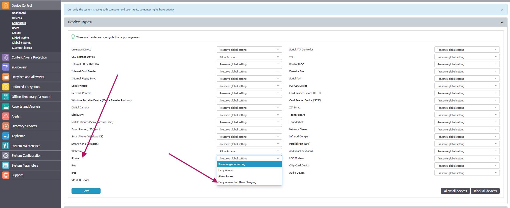

# How to Configure Deny Access but Allow Charging for iOS Devices

## Overview

The **Deny Access** right typically prevents iOS devices from charging. To address this, the **Deny Access but Allow Charging** right was introduced. This setting allows iOS devices to charge while access is denied. This feature is currently available for Windows and macOS.

## Instructions

1. In the **Netwrix Endpoint Protector Console**, navigate to the **Global**, **Computer**, **User**, or **Group** level settings.
2. Locate the **Deny Access but Allow Charging** option under **Device Types**.  
   
3. Select **Deny Access but Allow Charging** for the desired iOS devices.

> **NOTE:** This right prevents native sync, a common process for all iOS devices. Setting **Deny Access but Allow Charging** for any iPhone, iPad, or iPod can affect other iOS devices in Netwrix Endpoint Protector. Applying this right to a device type (for example, iPhones) may also apply it to other device types (such as iPads or iPods), regardless of the rights set on those devices. For granular control (Groups, Computers, Devices, etc.), ensure this right is set for a specific device and not for an entire device type.
