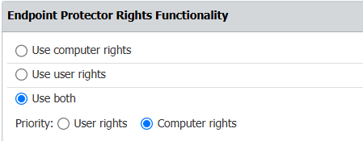

# Understanding the Rights Hierarchy for Devices

## Overview

This article explains the rights hierarchy for devices, which determines how permissions are applied and overridden in Netwrix Endpoint Protector.

The rights hierarchy for devices, from lowest to highest, is as follows:

1. Global Rights
2. Group Rights
3. Computer or User Rights (You can configure which takes precedence in **System Configuration > System Settings.**)
4. Devices

## Instructions

1. To set precedence between **Computer Rights** and **User Rights**, go to **System Configuration > System Settings** and select the desired option.  
   

2. **Custom Classes** have the highest priority and override all other rights. Use Custom Classes to globally set rights for a device or class of devices identified by VID, PID, and Serial Number.
