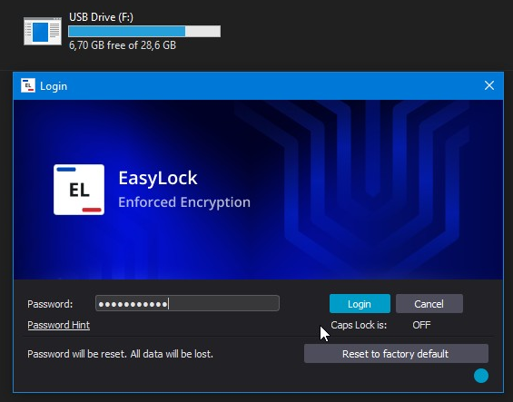

# How to Use EasyLock Without Endpoint Protector Software

## Question

How does the EasyLock software behave on a computer without Netwrix Endpoint Protector or its client software?

## Answer

When the EasyLock software is used on a computer without Netwrix Endpoint Protector or its client software, you can still launch it manually from the storage device and access your encrypted data by entering your password.

After you open EasyLock, the application will prompt you for a password. Any data you copy into the application will be encrypted using 256-bit AES software encryption. Only users with the correct password can access the encrypted data.

