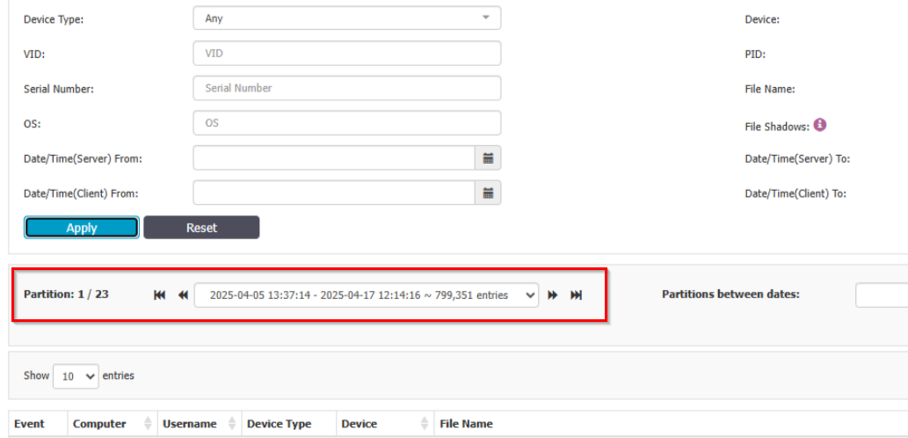

# Locate Logs in Content Aware Report When Using Partitions

## Overview

This article explains how to locate logs in the **Content Aware Report** when partitions are used. When you filter by specific dates, you may not see any results if the logs are stored on a different partition.

## Instructions

1. If no results are shown when filtering by date in the **Content Aware Report**, check which partition is currently selected.  
2. Select the partition that corresponds to the time interval you are searching for to view the relevant logs.

