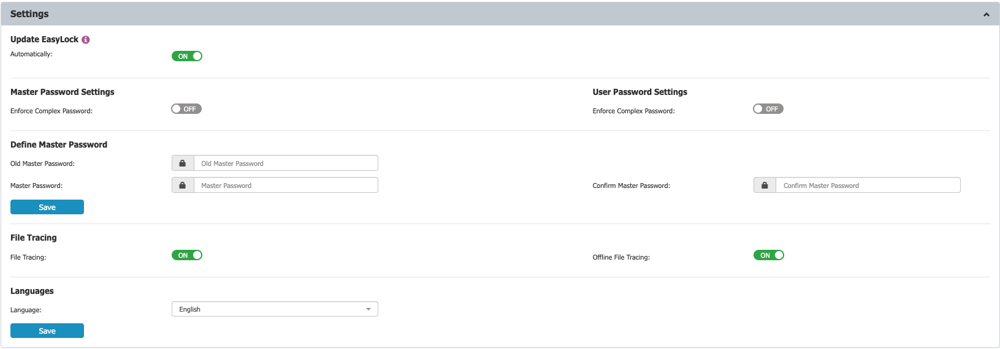
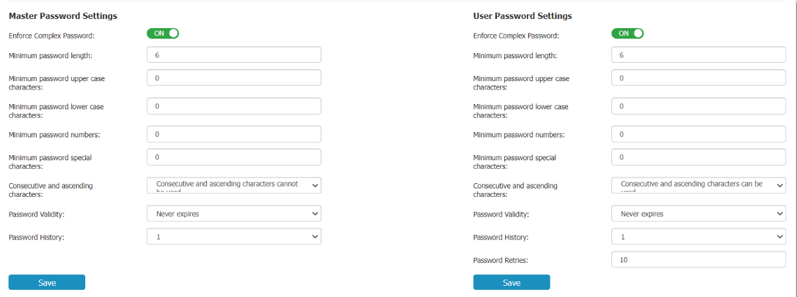

# Managing Enforced Encryption and File Tracing Settings

## Overview

The **Enforced Encryption Settings** section in Endpoint Protector allows remote management of encrypted devices. Before you use these features, you must configure a master password.

Within the **Settings** section, you can configure the master password, enable Enforced Encryption file tracing, and define whether Enforced Encryption can be installed and executed only on computers with the Endpoint Protector Client present.

Complex password rules can be enforced for both the master password and user password. If enabled, you can set password length, minimum character requirements, validity period, password history, and other settings.

## File Tracing Settings

Endpoint Protector allows tracing of files copied and encrypted on portable devices using Enforced Encryption.

You can activate this option from **Enforced Encryption** > **EasyLock** > **Settings** > **File Tracing/Offline File Tracing.**

By enabling the **File Tracing** option, all data transferred to and from devices using Enforced Encryption is recorded and logged for auditing. If the Endpoint Protector Client is present, the logged information is automatically sent to the Endpoint Protector Server. This occurs regardless of whether File Tracing is enabled for that specific computer in the **Device Control** module.

If the Endpoint Protector Client is not present, the information is stored locally in an encrypted format on the device and will be sent later from any computer with the Endpoint Protector Client installed.

The **Offline File Tracing** option extends this functionality by storing information directly on the device before it is sent to the Endpoint Protector Server. The list of copied files is sent the next time the device is plugged in and the Endpoint Protector Client is present and communicating with the server.

Additionally, EasyLock performs file shadowing for files transferred if the Endpoint Protector Client is present and the **File Shadowing** option is enabled on the computer through the **Device Control** module. This is a real-time event, and no shadowing information is stored on the device.

**NOTE:** Enabling global File Tracing does not automatically activate the File Tracing option on Enforced Encryption Trusted Device™ and vice versa.
