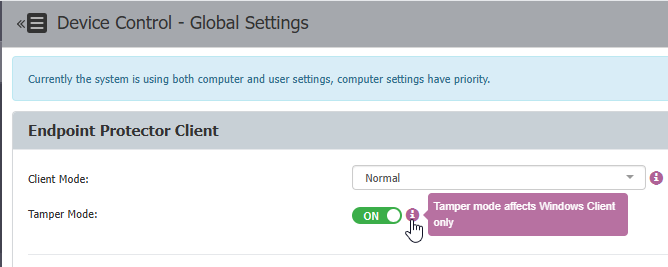

# Protect the Client from Unauthorized Uninstallation

## Overview

This article explains how you can secure the Netwrix Endpoint Protector (EPP) client on endpoint machines against unauthorized uninstallation. To address this matter, there are two security measures available:

- Set an Uninstall Password: Requires users to enter a password defined by the EPP system administrator before uninstalling the EPP client. This applies to Windows, Linux, and macOS endpoint machines.
- Enable Tamper Mode: Available starting with Netwrix Endpoint Protector Server version `5.8.0.0`, this feature safeguards agent integrity and prevents unauthorized termination or alteration of the Netwrix Endpoint Protector Agent. Tamper Mode is available for Windows endpoints only and can be enabled from the **Device Control > Global Settings** page.

## Instructions

### Set an Uninstall Password

1. Navigate to **System Configuration** > **System Security**.
2. Enter a password under **Security Password for Uninstall Protection** and click **Save**.

3. After saving the changes, a notification will appear stating the uninstall password is set.
4. Update the policies on the endpoint manually or wait for the policies to be automatically updated based on the time set for **Policy Refresh Interval**.

### Enable Tamper Mode

1. Navigate to **Device Control** > **Global Settings** > **Tamper Mode** and toggle the switch to **On**.
2. Scroll down to the bottom of the subsection labeled **Endpoint Protector Client** and click **Save**.

3. Update the policies on the endpoint manually or wait for the policies to be automatically updated based on the time set for **Policy Refresh Interval**.
