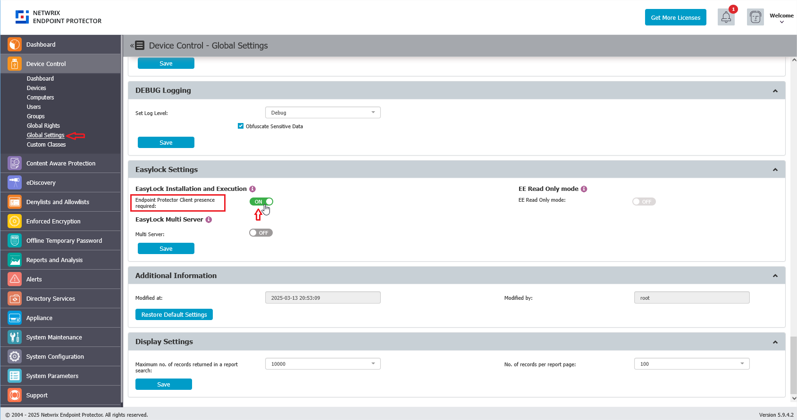

# Can the EasyLock App Be Opened Without the Endpoint Protector Agent Installed?

## Question
Can the EasyLock app be opened on a computer without the Netwrix Endpoint Protector agent installed?

## Answer
Yes, you can configure whether EasyLock can be opened only when the Netwrix Endpoint Protector agent is present or if it can be opened freely on any computer.

For the full reference, see [Enforced Encryption](/docs/endpointprotector/admin/ee_module/eemodule).

To configure this option, navigate to **Device Control** > **Global Settings** > **EasyLock Settings** and toggle the switch next to **Endpoint Protector Client presence required**.

- **Enabled (dependency required):** EasyLock only opens on computers where the Endpoint Protector Client is installed and running.
- **Disabled:** EasyLock can be opened freely on any computer, including ones without the Endpoint Protector Client.

:::tip
For a middle-ground option, consider **Enforced Encryption Read-Only Mode** instead of fully disabling the Client presence requirement. This optional, configurable mode lets you grant **read-only** access to Enforced Encryption-encrypted drives on unmanaged computers — personal devices, conference room setups, or exhibition areas — without requiring the Endpoint Protector Client, while still preventing writes to the drive. Enable it under **Device Control** > **Global Settings**, in the same Enforced Encryption / EasyLock Settings area as **Endpoint Protector Client presence required**, by switching on the **EE Read-Only mode** toggle. See [Enforced Encryption in Read-Only mode](/docs/endpointprotector/admin/ee_module/eemodule#enforced-encryption-in-read-only-mode) for details.
:::

:::important
After deploying the Enforced Encryption Client with Read-Only mode enabled, launch the EE Client for the first time on an EPP Client-managed computer to complete the configuration process.
:::
