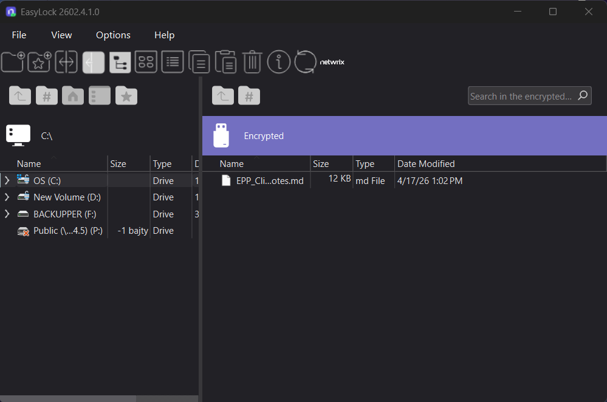

# How to Use EasyLock Without Endpoint Protector Software

## Question

How does the EasyLock software behave on a computer without Netwrix Endpoint Protector or its client software?

## Answer

When the EasyLock software is used on a computer without Netwrix Endpoint Protector or its client software, you can still launch it manually from the storage device and access your encrypted data by entering your password.

:::important
This behavior depends on the **Endpoint Protector Client presence required** setting (**Device Control** > **Global Settings** > **EasyLock Settings**). If this setting is enabled, EasyLock only opens on computers where the Endpoint Protector Client is installed and running — it won't open on a computer without the Client at all, regardless of password. If disabled (the scenario this article covers), EasyLock opens freely on any computer. See [Can the EasyLock App Be Opened Without the Endpoint Protector Agent Installed?](/docs/kb/endpointprotector/enforced-encryption-easylock/can-the-easylock-app-be-opened-without-the-endpoint-protector-agent-installed) for how to configure this setting, including the optional **Read-Only Mode** for unmanaged computers.
:::

After you open EasyLock, the application will prompt you for a password. Only users with the correct password can access the encrypted data.

For the full reference, see [Enforced Encryption](/docs/endpointprotector/admin/ee_module/eemodule).

:::note
Starting with Enforced Encryption version 3.0.0.2 (5.9.4.2 release), new data is encrypted using a **FIPS 140-3 validated** engine, which replaced the previous 256-bit AES CBC-mode encryption. The FIPS 140-3 engine is backward compatible — drives encrypted with the older 256-bit AES engine remain readable — but drives encrypted with the FIPS 140-3 engine aren't compatible with older Enforced Encryption Clients. To avoid compatibility issues, keep your EE Clients up to date. You can verify the encryption engine version in use from the **About** section of the EasyLock/Enforced Encryption application. See [Enforced Encryption 140-3 FIPS Validated Engine](/docs/endpointprotector/admin/ee_module/eemodule#enforced-encryption-140-3-fips-validated-engine) for details.
:::
