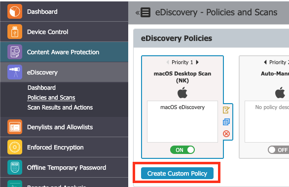

# Creating eDiscovery Policies and Scans

## Overview

This article explains how to create custom eDiscovery policies and manage scans in Netwrix Endpoint Protector. You can define scan types, configure scan intervals, and review scan results using the eDiscovery module.

## Instructions

1. In the Netwrix Endpoint Protector Console, navigate to **eDiscovery** > **Policies and Scans** and click the **Create Custom Policy** button.  
   

2. Choose the OS type, provide a policy name, select items of focus and click **Save**.

3. After agents are deployed, a section for defined scans will appear under **Policies and Scans**.

4. Select a defined scan to configure scanning options:
   - Choose **Manual Scanning** or **Automatic Scanning**. If **Automatic Scanning** is selected, configure the scan interval in the window that appears.
   - Select either a **clean scan** for a full assessment or an **incremental scan** which is recommended after an initial clean scan.

5. When scan results are available, choose the **Action** to **Inspect found items** or navigate to the **Scan Results and Actions** section within the eDiscovery expansion tree in the Management Console.
