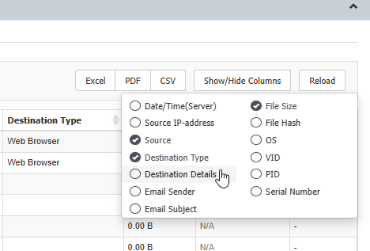

# How to Display the Destination URL in Content Aware Reports

## Overview

This article explains how to display the **Destination URL** in Content Aware Reports in Endpoint Protector. Starting with Endpoint Protector Server version 5700, **Reporting V2** must be enabled to access this feature.

## Instructions

1. To enable **Reporting V2**, navigate to the **Endpoint Protector Management Console** > **System Configuration** > **System Settings**.
2. Enable the **Reporting V2** option.
3. Navigate to **Reports and Analysis** > **Content Aware Reports**.
4. Click the **Show/Hide Columns** button.
5. Select the **Destination** column to display the Destination URL in the report.

