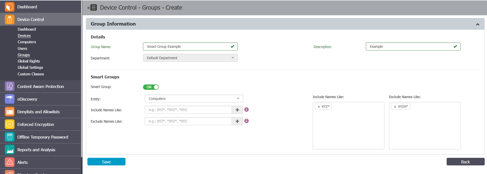

# Using Smart Groups for Automatic Computer and User Assignment

## Overview

Smart Groups enable automatic assignment of computers or users to groups based on name patterns. By configuring wildcard rules, you can include or exclude entities from groups without manual intervention.

## Instructions

1. In the Netwrix Endpoint Protector Console, navigate to **System Configuration** > **System Settings** and enable **Smart Groups**.
2. Navigate to **Device Control** > **Groups**.
3. Mark the desired group as a smart group.
4. Name the group and select the department from which you want to add computers or users.
5. Select either **Computers** or **Users** to add to the group.
6. Specify which entities to include by typing a specific part of the entity name using wildcards:
   - `XYZ*` — Name starts with XYZ
   - `*XYZ*` — Name contains XYZ
   - `*XYZ` — Name ends with XYZ
7. To exclude certain computers or users from the group, specify names or patterns to be excluded.
8. For example, all computers with names starting with **XYZ** will be included in the group, except those starting with **XYZA**.  
   
