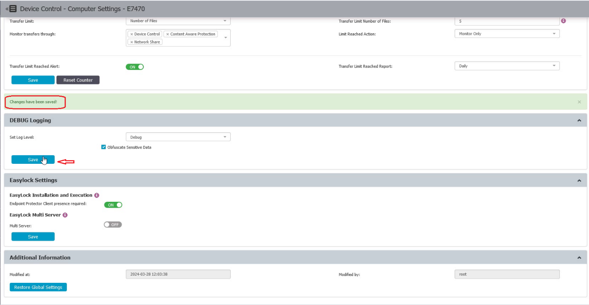
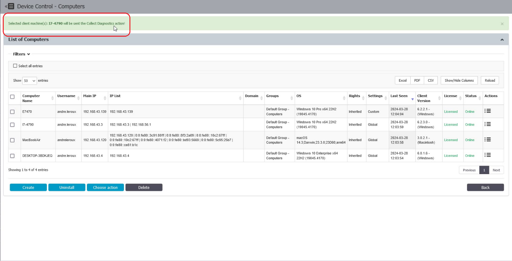

# How to Remotely Activate and Collect Client Logs from the Server Interface

## Overview

This article explains how to remotely enable debug logging on an endpoint machine and collect client logs from the server interface, without requiring input or knowledge from the endpoint user.

## Instructions

1. In the **Endpoint Protector Console**, navigate to **Device Control > Computers**, then select the target computer and click **Manage Settings**.  
   

2. Scroll down to **Debug Logging**, then click the **Set Log Level** drop-down menu and select **Debug**.  
   

3. After selecting **Debug**, click **Save** and wait for the green notification confirming that the changes have been saved.  
   

4. On the computer, refresh the policies and reproduce the issue.

5. Return to the computer listed under **Device Control > Computers** and click **Collect diagnostics**.  
     
   

6. Logs will be sent to the server under **Reports and Analysis > Logs Report**.  
   

7. Navigate to **Reports and Analysis > Logs Report**.

8. Expand the filters. Click the **Event** drop-down menu, then select **Artifact Received** and click **Apply**.  
   

9. Under the events, the uploaded artifact or client logs will be listed and available for download by the system administrator.  
   > **NOTE:** The artifact may not be available for immediate download and may display a "File not found" error. It can take 20–30 minutes before the file is ready to download."
   

10. Once the client logs are downloaded, submit them to the support team as needed.