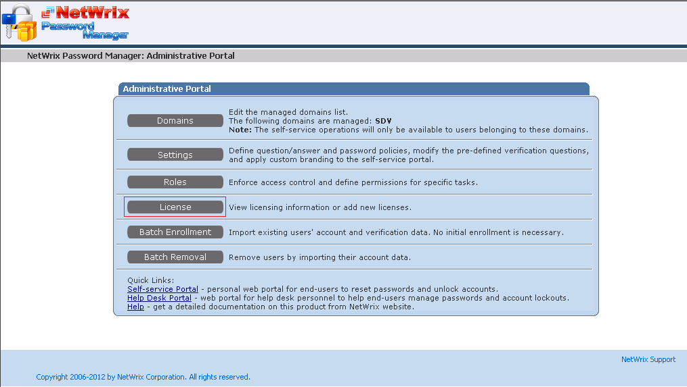
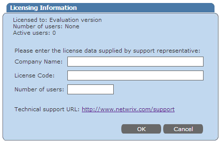

# How to apply license to Password Manager

How to apply license code to Password manager?

To enter a new license, do the following:

1. In the browser navigate to the Admin portal of Password Manager (default URL is `http://%pmserver%/pm/admin`)
2. Click the **License** button

3. If there is a license applied already, click **Change license**.
4. Enter the new code and click **OK**.

**Note:** When entering the license code it is recommended to use copy/paste to input the license code. Also it is common if copying from an HTML document to also copy an extra space so ensure these are removed upon paste.
