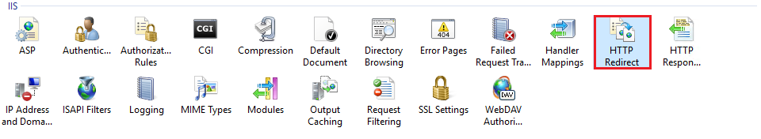
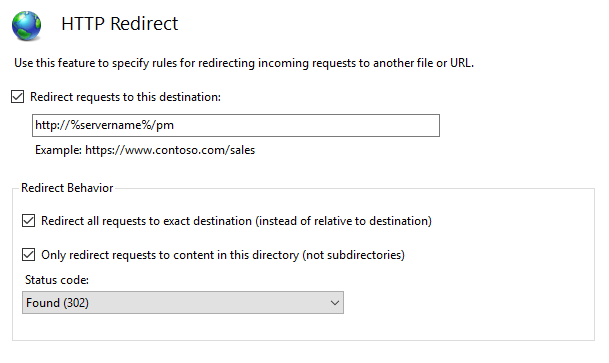
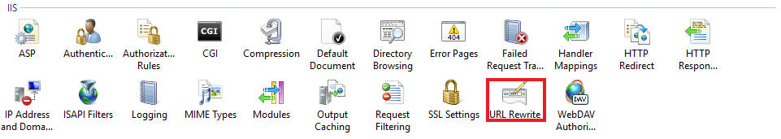
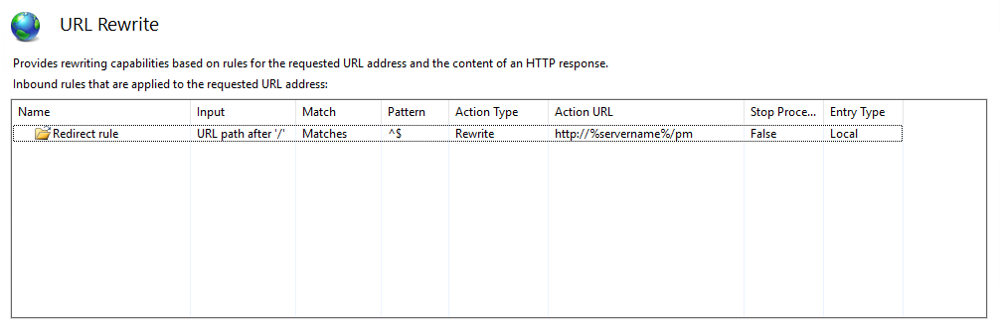

# How to create a redirection for the Password Manager web portal

## Question

You want users to access Password Manager by browsing to the server root (for example, `http://<servername>`) instead of `http://<servername>/pm`. How can you redirect users to the Password Manager website?

## Answer

You can redirect users to the Password Manager self-service portal using one of these options:

### Option 1. Modify the default `iisstart.htm`

Change the `iisstart.htm` file in the root folder of the Default Web Site. Note that you will not be able to see the default IIS page after this change.

1. Locate `iisstart.htm` (by default at `C:\inetpub\wwwroot`), right-click it and select **Edit**.
2. Replace the existing text in the file with the following HTML:
```html
<html> <head> <meta http-equiv="Refresh" content="0; url=http://%servername%/pm" /> </head> </html>
```
3. Save changes to the file.

### Option 2. Use the **HTTP Redirect** feature of IIS

Refer to the IIS documentation for additional information: http://www.iis.net/configreference/system.webserver/httpredirect



Perform the following steps:

1. In the left pane of **IIS Manager** navigate to the website that contains the Password Manager virtual directory (by default “PM”).
2. In the central pane, double-click the **HTTP Redirect** icon under the **IIS** category.
3. Check the **Redirect requests to this destination** checkbox and enter the URL to redirect to (for example, `http://%servername%/pm`).
4. Check the **Redirect all requests to exact destination (instead of relative to destination)** checkbox.
5. Check the **Only redirect requests to content of this directory (not subdirectories)** checkbox.
6. Set **Status code** to **Found (302)**.
7. Click **Apply** in the right pane.



### Option 3. Use **URL Rewrite** rules

Download and install the URL Rewrite module from: http://www.iis.net/downloads/microsoft/url-rewrite



After installing the URL Rewrite module, perform these steps:

1. In the left pane of **IIS Manager** navigate to the website that contains the Password Manager virtual directory (by default “PM”).
2. In the central pane, double-click the **URL Rewrite** icon under the **IIS** category.
3. Click **Add rule(s)…** in the right pane.
4. Select **Blank rule** under **Inbound rules** and click **OK**.
5. Enter a **Name** for the rule.
6. In the **Match URL** area:
   a. Select **Requested URL: Matches the pattern** and **Using: Regular expressions** in the dropdown lists.  
   b. Enter the following **Pattern:** `^$`.  
   c. Check the **Ignore case** checkbox.
7. In the **Action** area:
   a. Select **Action: Redirect** from the dropdown list.  
   b. Enter the **Redirect URL** (for example, `http://%servername%/pm`).  
   c. Check the **Append query string** checkbox.  
   d. Select **Redirect type: Permanent (301)** from the dropdown list.
8. Click **Apply** and then click **Back to Rules**. The configured rule should now be listed.
9. Restart IIS by running the `iisreset` command in **Command Prompt** run as administrator.



These steps allow the self-service portal to be accessible via the short URL `http://<servername>` instead of `http://<servername>/pm`.

**NOTE:** If you want to make the self-service portal accessible from an external network, create a DNS alias (CNAME) for the Password Manager self-service portal address. See the Microsoft documentation for details: https://learn.microsoft.com/en-us/windows-server/networking/core-network-guide/cncg/server-certs/create-an-alias-cname-record-in-dns-for-web1
