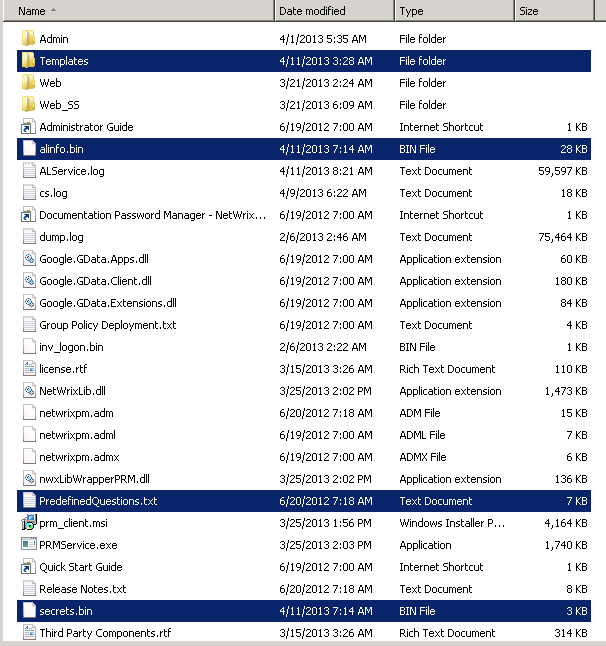

# How to migrate Netwrix Password Manager to another server?

---

To migrate Netwrix Password Manager perfrom the following steps:

1. Install Netwrix Password Manager on a new server.
2. Then, stop the product service on the new server.
3. Stop the Netwrix Password Manager service on the old server
4. Copy the following files from the Password Manager installation directory on the old server to the same location on the new server:
   - `secrets.bin`
   - `alinfo.bin`
   - `PredefinedQuestions.txt` (if you changed predefined questions)
   - `Templates` subfolder (if you cahnged notifications text)

5. Start the Netwrix Password Manager service on the new server.
6. Wait for several minutes to allow the service read the users enrollment data.
7. Go to Administrative portal and apply license
8. Make sure firewall is configured corretly o the new server to accept connections

**NOTE.** If you use the Password Manager clients, change the Password Manager server address in their settings.To do this, perform the following steps

1. Navigate to **Start - -> Group Policy Management** Console snap-in.
2. Right-click the GPO created for Netwrix Password Manager and select **Edit** from the popup menu.
3. In the dialog that opens, navigate to **Computer Configuration - -> Administrative Templates - -> &lt;Your_Password_Manager_Template&gt;**.
4. In the right pane, specify the new server URL in the **Password Manager Server URL** entry field.
