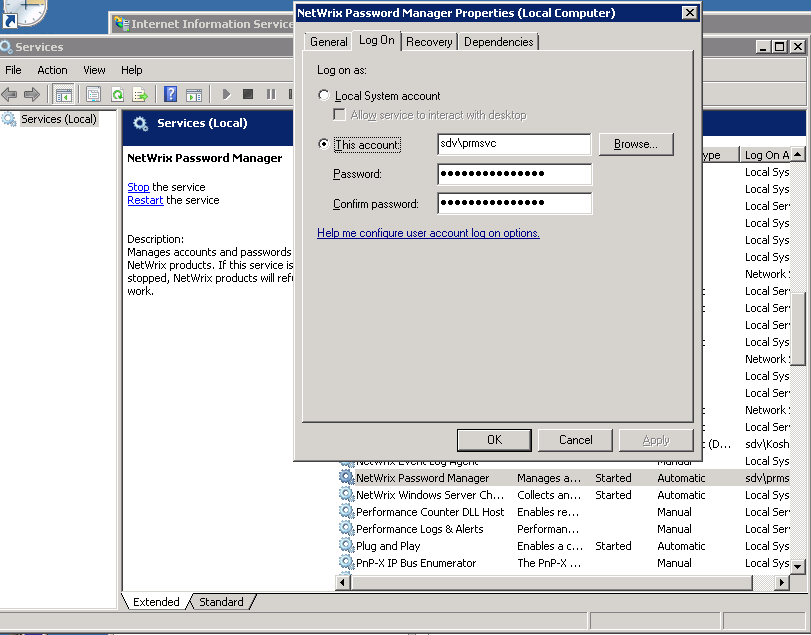

# How to modify the Password Manager Service account

Password Manager runs as a service. The service account is the account you use to run the Netwrix Password Manager service. The Password Manager installer prompts you for the credentials of this account.

## Modify the service account

To modify this account after installation, do the following:

1. Run the **Services** snap-in (navigate to **Start** -> **Run** and type `services.msc`).
2. Locate the **Netwrix Password Manager** service.
3. Right-click it and select **Properties**.
4. Navigate to the **Log on** tab.
5. Specify the account you want to use to run the service.
6. Click **OK** and restart the service.

