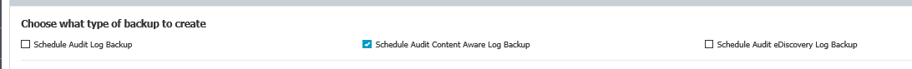
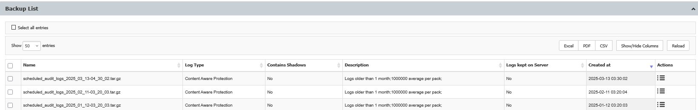

# Configure the Audit Log Backup

## Question

How can the Audit Log Backup be configured?

## Answer

The Audit Log Backup can be configured from the **System Maintenance** > **Audit Log Backup** menu, which includes two main options: **Manual Audit Log Backup** and **Scheduled Audit Log Backup**.

Use the **Manual Audit Log Backup** option to perform a one-time backup of audit logs. Use the **Scheduled Audit Log Backup** option to create recurring backups at a frequency you choose. Both options allow you to select the type of logs to back up, set retention and packaging preferences, and choose whether to include file shadows.

### Manual Audit Log Backup

Use this option to perform a one-time backup of audit logs.

### Scheduled Audit Log Backup

Use this option to create a recurring audit log backup that runs at a frequency you choose (from a few days to several months). This is similar to the manual backup, but it runs automatically at the specified interval.

### Configure the Audit Log Backup

1. Choose the type of logs you want to back up.  
   

2. If you intend to delete logs after backup to avoid filling up the server, leave the following option unchecked:  
   

3. Select which old logs to back up. All logs older than the specified number of days or months will be removed from the server and saved as backups.  
   

4. Select the number of logs in one package; the default is 1 million.

5. Select the backup file format.

6. Choose whether to delete and back up Shadows as well. Including Shadows is recommended, as file shadows can occupy more space than logs and may be the main cause of increased server disk space usage.

7. Once the Audit Log Backup has completed, the archived logs will appear at the bottom of this menu in the **Backup List**:
   