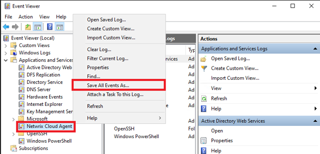

# How to Save and Zip the Netwrix Cloud Agent Event Log

## Question

How can you export and compress the Netwrix Cloud Agent event log?

## Answer

You can save and zip the Netwrix Cloud Agent event log using either the Command Prompt or the Event Viewer. The following steps will guide you through each method:

> **NOTE:** Perform these steps on the server where the Netwrix Cloud Agent is installed.

### Export Cloud Agent event log via Command Prompt

Execute the following command in an elevated Command Prompt line:

```bat
wevtutil epl "Netwrix Cloud Agent" %userprofile%\desktop\NCA.evtx
```

The exported Cloud Agent event log will appear on your Desktop.

### Export Cloud Agent event log via Event Viewer

1. Open **Event Viewer**.
2. Expand the **Applications and Services Logs** folder in the left pane.  
   
3. Right-click on **Netwrix Cloud Agent** and select **Save All Events As**.
4. Name the file and click **Save**.
5. Once the file is saved, right-click it and zip the file.
