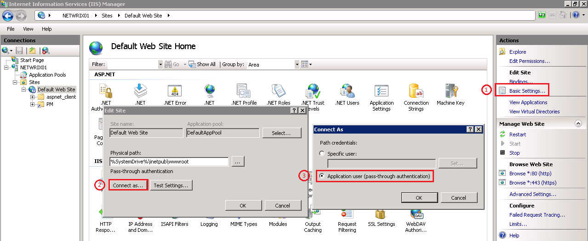

# All users are able to access all Password Manager portals

All users are able to access all Password Manager portals, regardless of the roles assigned within Password Manager.

---

A user has been specified for path credentials in IIS. You need to use pass-through authentication, so the credentials of the user using the website are passed through, instead of forcing a service account/specific user.

---

## Resolution

Perform the following steps in IIS on the Netwrix Password Manager Server:

1. Open IIS  
2. Click on **Default Web Site** or whatever site you put Netwrix Password Manager under  
3. Click **Basic Settings** on the right  
4. Click the **Connect as...** button  
5. Select **Application user (pass-through authentication)**

Note that the **Self Service Portal** uses **Anonymous Authentication** so any user should be able to access it but only users defined in the **Role** are allowed to perform actions on their accounts.

See the image below for reference

