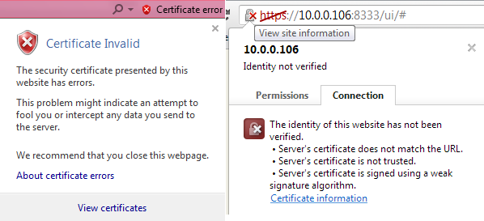
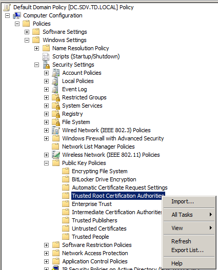

# Automatic user enrollment failed: The certificate authority is invalid or incorrect (Error code: 12045)

## Problem
On startup, the enrollment wizard does not start and returns the following error:

"Automatic user enrollment failed: The certificate authority is invalid or incorrect (Error code: 12045)"

## Cause
This issue occurs when you use a self-signed SSL certificate for the Self-Service portal.

## Resolution
To resolve the issue, either obtain a signed third-party SSL certificate, or deploy the self-signed certificate to the root CA (certificate authority) store of all problematic workstations.

## To deploy a self-signed certificate
1. Save the certificate to a file locally. To do this:
   - Browse to the website you have assigned a certificate to.
   - Click Agree to continue on the notification screen.
   - In the address bar, find the certificate and open the certificate information (see screenshots – **View certificates** or **Certificate information**).

   

2. Go to the **Details** tab and click **Copy to file…** (a wizard opens).
3. Select **Cryptographic Message Syntax Standard (PKCS #7)** and click **Next**.
4. Select a path to save the file and click **Next**, then click **Finish**.
5. Copy the file to the machine where Group Policy Manager is installed.
6. Start **Group Policy Manager** and edit **Default Domain Policy**.
7. In the Group Policy Object Editor, navigate to:
   **Computer Configuration - Windows Settings – Security Settings - Public Key Policies - Trusted Root Certification Authorities**, right-click and select **Import**.
8. In the wizard, specify the file you created earlier and click **Next**.
9. Leave Certificate Store as default and click **Next**, then click **Finish**.
10. Run `gpupdate /force` or wait until the policy applies automatically.

## Additional notes
- Also make sure that the name of the server stored in the certificate matches the name you specified on the Password Manager client setup.

More screenshots here: [Deploying a Self-Signed Root Certificate with Group Policy](http://unixwiz.net/techtips/deploy-webcert-gp.html)
