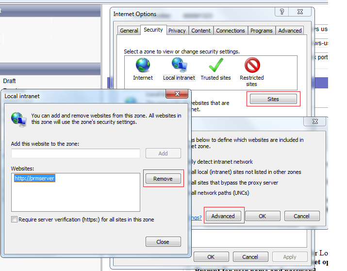
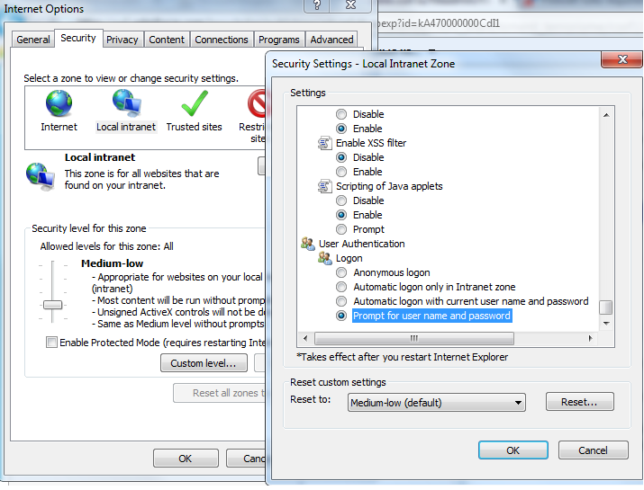

# Does the Password Manager always use your current Windows user to authenticate?

Netwrix Password Manager uses Integrated Windows authentication. By default for Local Intranet zone there is a setting to logon automatically using current credentials.

There are two options to force prompting for credentials:

1. Move Helpdesk portal to the Internet zone.  
   To do it, go to **Control panel - Internet options - Security** tab. Select Local Internet zone, click **Sites** and remove the Helpdesk portal URL. Click **Ok** and then disable Automatic detection of local intrnate sites.

   

2. Disable automatic authentication for Local intrantet zone  
   To do it, go to **Control panel - Internet options - Security** tab. Select Local Intranet zone, click Custom level, in subwindows scroll to the very bottom and under **User Authentication - Logon** select **Prompt for user name and password**.

   
